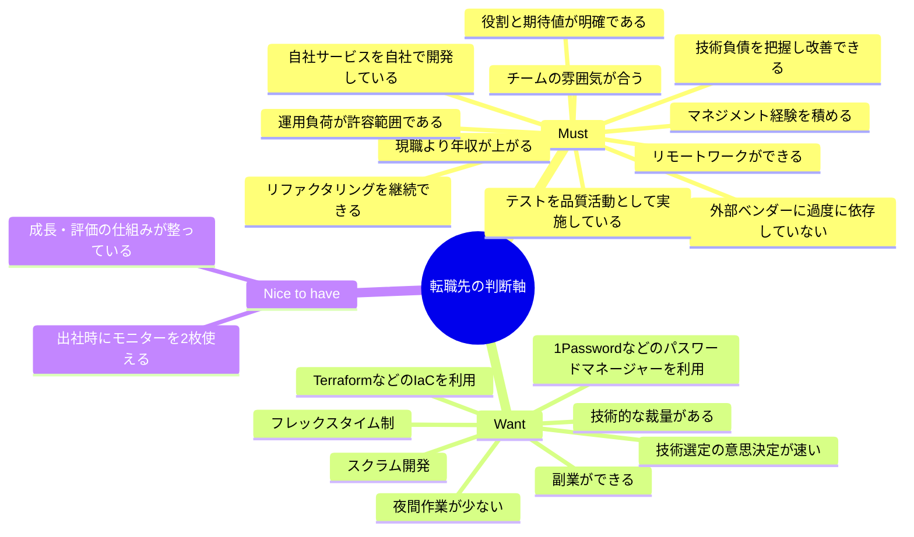
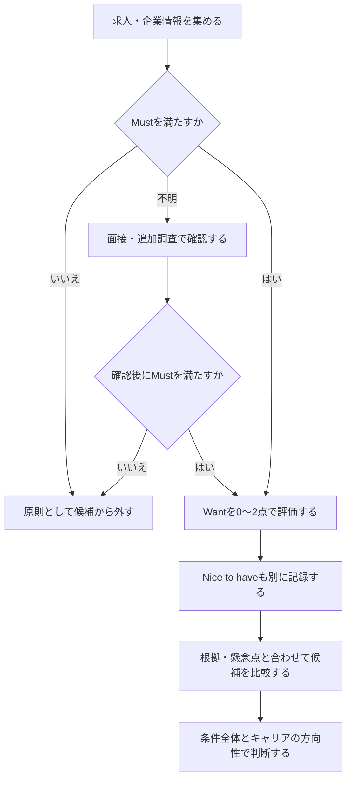

# 転職先の判断軸

転職先を選ぶときに重視する条件を整理し、求人選びや面接で一貫した判断をするためのメモです。現時点の希望をまとめた**たたき台**です。条件の具体的な水準は、実際の求人を比較しながら更新します。

## 判断軸の全体像

## Must：応募・入社判断の必須条件

Must は「理想的だとうれしい」ではなく、満たさない場合に応募や入社を見送る条件です。情報が確認できない場合は、すぐに不合格とはせず「要確認」として面接などで確かめます。

| 条件          | 現時点の希望                | 判断時に確認すること                                     |
| ----------- | --------------------- | ---------------------------------------------- |
| リモートワーク     | リモートワークができること         | フルリモートか、出社頻度・出社場所・将来の変更可能性はどうか                 |
| 年収          | 現職より上がること             | 基本給、賞与、固定残業代、手当を分け、現職と同じ基準の総年収で比較する            |
| 自社サービス・自社開発 | 自社サービスがあり、自社で開発していること | 自社プロダクトの開発チームがあり、ロードマップや設計に継続して関われるか           |
| ベンダー依存      | 外部ベンダーに過度に依存していないこと   | ソースコード、設計判断、運用知識が社内にあり、自社チームが主体的に変更・運用できるか     |
| 技術負債        | 技術負債が放置されていないこと       | 負債の存在を把握・共有し、返済の優先順位や時間を確保しているか。負債が全くないことは求めない |
| リファクタリング    | リファクタリング文化があること       | 改善を継続的に行う時間・レビュー習慣があり、変更の安全性を保てているか            |
| テスト         | テスト文化があること            | 自動テストの範囲、CIでの実行、リリース前の確認方法、品質改善の取り組みはどうか       |
| マネジメント経験    | マネジメント経験を積めること        | スクラムマスターや開発リーダーに加え、将来のテックリード・EMなど、どの役割に挑戦できるか  |
| 運用負荷        | 継続可能な運用負荷であること        | オンコールや障害対応の頻度・体制、夜間休日対応、属人化の有無はどうか             |
| チームの雰囲気     | 自分に合うチームで働けること        | 意見や懸念を安心して伝えられるか。レビューや振り返りで建設的な対話ができているか       |
| 役割と期待値      | 入社後の役割と期待成果が明確であること   | 担当範囲、入社後の目標、評価基準、関係者との役割分担は明確か                 |

> 「技術負債がない」は多くの開発現場で現実的な判定が難しいため、「負債を可視化し、品質や開発速度を損なわないよう計画的に改善できる」を判断基準にします。

## Want：比較・加点に使う条件

Want は必須ではありません。候補企業同士を比較するときに、実態を確認して加点します。

| 条件 | 確認すること |
| --- | --- |
| 副業 | 副業が就業規則上認められ、申請条件や競業避止の範囲が明確か |
| フレックスタイム | コアタイムの有無、標準労働時間、チームの実際の運用はどうか |
| IaC | Terraformなどでインフラをコード管理し、レビューや適用の手順が整っているか |
| 技術選定の意思決定 | 新技術を試す提案から検証・採用判断までのプロセスと期間はどうか |
| 夜間作業 | 定常的な夜間作業の有無、オンコール頻度、障害対応後の代休・手当はどうか |
| パスワードマネージャー | 1Passwordなど、会社・チームで安全に認証情報を管理する仕組みがあるか |
| スクラム開発 | スクラムのイベントを行うだけでなく、振り返りから改善につなげているか |
| 技術的な裁量 | 設計や技術選定にどの程度関われるか。提案や改善を進める余地があるか |

## Nice to have：あれば嬉しい条件

必須でも優先条件でもありませんが、候補企業を比較するときの加点要素として記録します。

| 条件       | 確認すること                             |
| -------- | ---------------------------------- |
| 成長・評価    | 評価基準やフィードバックの頻度、昇給・昇格の仕組み、学習支援が明確か |
| 出社時のモニター | 出社して働く場合、モニターを2枚利用できる環境があるか        |

## 候補企業の評価方法

### 1. Must を確認する

各 Must を「○：満たす」「△：要確認」「×：満たさない」で記録します。×があれば、応募・選考を続ける価値がある例外的な理由がない限り、候補から外します。△は求人票だけで判断せず、面接で確認します。

### 2. Want と Nice to have を比較する

Want と Nice to have は、次の3段階で評価します。Nice to have はWantとは分けて記録し、Mustの判断を覆す材料にはしません。

| 点数 | 目安 |
| --- | --- |
| 0 | ない、または希望と合わない |
| 1 | 一部ある、もしくは運用が不明確 |
| 2 | 実態が確認でき、希望に合う |

点数だけで決めず、面接で聞いた具体例や懸念点も記録します。

## 候補企業の比較メモ

| 企業 | Mustの判定・要確認事項 | Wantの点数 | Nice to have | 根拠・懸念点・次に確認すること |
| --- | --- | --- | --- | --- |
|  |  |  |  |  |

## 面接で確認する質問例

- 開発チームでは、リファクタリングや技術負債の返済にどのように時間を確保していますか？
- 自動テストはどの範囲で実施し、CIやリリース判断にどう組み込んでいますか？
- 直近で技術選定を行った例と、提案から採用判断までの進め方を教えてください。
- 開発者は設計や技術選定にどの程度関われますか？改善提案はどのように検討されますか？
- 開発業務のうち、外部ベンダーと自社チームの担当範囲はどのように分かれていますか？
- このポジションで入社後に期待される成果や、他のメンバーとの役割分担を教えてください。
- チーム内で意見が分かれたとき、どのように意思決定していますか？最近の振り返りや改善例も教えてください。
- オンコールや障害対応の頻度・体制、夜間休日対応の実態を教えてください。
- 出社時の頻度や座席環境、モニターの利用環境について教えてください。
- 評価基準やフィードバックの頻度、学習支援の仕組みを教えてください。

## 次に決めること

- [ ] 希望する年収の下限と、比較に使う年収の定義
- [ ] 許容できる出社頻度と、フルリモートが必須かどうか
- [ ] 「自社開発」とみなす事業・開発体制の範囲
- [ ] ベンダー依存を許容できる範囲
- [ ] 技術負債やテスト状況について、入社判断で許容できる最低ライン
- [ ] 積みたいマネジメント経験（スクラムマスター、開発リーダー、テックリード、EMなど）の優先順位
- [ ] 副業・夜間作業を Must に引き上げる必要があるか
