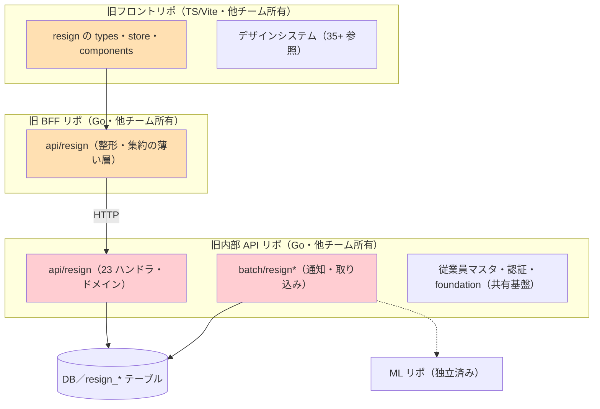
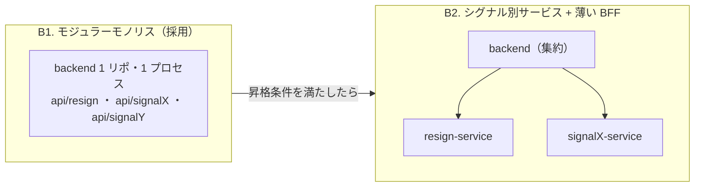
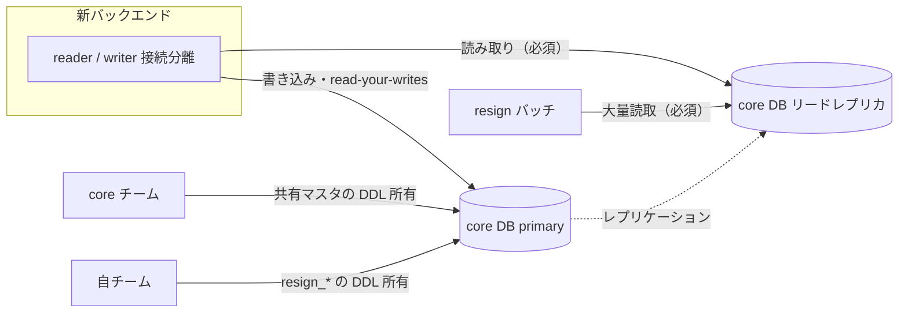

> **執筆メモ（公開前に消す）**: 本文は完了形で書いていますが、執筆時点（2026-10）では切り出しの ADR が Proposed のままです。Accepted 化を待って公開してください。遅延の原因（他チームの作業待ち・自チームは概ね予定どおり・待ち期間にテストケースを巻き取り）は著者確認済み。他チームの作業内容は記事では特定していません。新ドメインへの本番切替日は Jira に記録がなく、本文では日付を出していません。インフラ側（CodeDeploy 廃止・ECS ネイティブ Blue/Green・ecspresso）は別記事に分けます。

## TL;DR

- 離職リスク予測という 1 機能が、**フロント・BFF・内部 API の 3 リポに分散**し、すべて他チームの所有でした
- 独立チーム化に合わせて、**リポとデプロイの境界をチーム境界に一致させる**切り出しを行いました（Conway の法則）
- 棚卸しの結果は 595 ファイル・約 36,300 行。ただし**逆依存 0・共有結合は 2 テーブルの JOIN のみ**で、「量は多いが境界はきれい」でした
- BFF は層として作らず、バックエンドはモジュラーモノリスで開始。共有は認証とデザインシステムに限定し、それ以外は複製を許容しました
- Go の共有ライブラリは作らず、スキーマ共有 + 各リポで client 生成の方針にしました。ただし上流の spec が管理されていないと分かり、codegen は見送りました
- 最大リスクは DB の切替でした。当初の「別 DB へ分離」案は組織方針で上書きされ、core DB 直結・読み取りはリードレプリカ必須に落ち着きました
- 完了見込みは 7/31 から 8/21 へ約 3 週間ずれました。原因は他チームの作業待ちで、皮肉にも切り出しの動機そのものでした

## この記事の対象読者

- モノリスや共有リポの一部を、別チームへ切り出そうとしている方
- BFF を「とりあえず」置いていて、本当に必要か迷っている方
- 共有ライブラリを作るか複製するかの線引きに悩んでいる方
- 切り出しの計画で、コード量ではなく何をリスクとして見積もるべきか知りたい方

## 環境

- フロントエンド: TypeScript + Vite
- バックエンド: Go（標準 `net/http` ＋ oapi-codegen、gorm、goose）
- DB: MySQL（共有 core DB、リードレプリカあり）
- ML: Python（別リポとして既に独立済み）
- インフラ: AWS（ECS Fargate、Step Functions、CloudFront）、Terraform

## 背景：業務本体が他チームのリポに同居していた

私たちのプロダクトは LightGBM + SHAP による離職リスク予測を提供しています。コードは人事プロダクト全体を扱う 3 つのリポに分散していました。

問題は 1 つです。**業務本体が他チーム所有のリポにある**ため、バックエンドを変えるたびに他チームのレビューとリリースに依存していました。独立チームとして進める方針が決まった以上、この構造のままでは独立性が骨抜きになります。

もう 1 つ前提がありました。新しいプロダクトは離職リスク専用ではなく、**複数のシグナル（エンゲージメント、パフォーマンス等）を載せるプラットフォーム**として作る、ということです。離職シグナルは最初の 1 つに過ぎません。この前提が、後の BFF とモジュラーモノリスの判断に効いてきます。

### 棚卸し：595 ファイル・36,300 行、しかし逆依存はゼロ

ADR を書いた 2 日後に、3 リポを実コードで横断調査しました。grep と import 解析と `wc -l` です。

| リポ | 対象 | ファイル数 | 概算 LOC | 主要単位 |
| --- | --- | ---: | ---: | --- |
| 旧内部 API（Go） | `api/resign` + `batch/resign*` + `cmd/resign-*` | 189 | ~11,620 | 23 エンドポイント / 2 バッチ |
| 旧 BFF（Go） | `api/resign` | 261 | ~10,284 | 22 エンドポイント |
| 旧フロント（TS） | resign 関連の features / store / types | 145 | ~14,405 | 16 ルート中 4 |
| **合計** | | **595** | **~36,300** | |

フロントでは、プロジェクト全体 467 ファイル・53,880 行のうち resign が 31% のファイル、27% の行を占めていました。

量は多いのですが、構造を見ると**想定よりずっときれい**でした。

1. 内部 API の resign は**逆依存ゼロ**。共有側から resign を import している箇所は 0 件で、完全に自己完結していました
2. 共有テーブルとの結合は **`employees` / `roles` の JOIN だけ**。resign のテーブルはすべて `resign_*` で名前空間が分かれていました
3. フロントの負債は事前の懸念より小さく、デザインシステムとの循環依存は**わずか 1 ファイル**、fork は 3 コンポーネント、ドメイン外の store は 3 つでした
4. BFF から内部 API への呼び出しは **14 本の HTTP 呼び出し**に整理済みで、契約化の対象が最初から列挙できていました

結論は「負債は巨大で絡まっているのではなく、**量は多いが境界がきれいで、lift-and-shift + 契約化 + feature 移植で解ける**タイプ」でした。構造はきれい、問題は所有だけ。これが切り出しの実現可能性を大きく上げました。

## 判断 1：BFF は本当に必要か

旧構成には BFF がありました。BFF が価値を出すのは「複数フロント」「複数バックエンドの集約」「フロントとバックのチーム分離」のときです。

現状を当てはめると、Web フロントは 1 つ、BFF が叩くバックエンドは 1 つ、チームはこれから同じになります。BFF の正当化理由のうち効いていたのは**「裏側変更の遮蔽」だけ**でした。実際、22 エンドポイントの大半は 1:1 のパススルーで、集約していたのは 1 本だけです。

ADR の段階では「複数シグナルが増えれば複数バックエンドを集約する本物の BFF が正当化される。**今は薄く、増えたら厚く**」という発展経路を取りました。その後のフロント契約の分析で、薄い BFF の層そのものを置かず、**フロントからバックエンドへ直結**する方針に固めました。整形・集約・裏側遮蔽という BFF の責務は、バックエンド内部の責務として吸収しています。

層を 1 つ減らした結果、インフラ上も外部 ALB + 内部 ALB の 2 段が 1 段に集約されました。Redis も新設していません。resign 側の唯一の用途がマスタ設定の集約キャッシュで、これは source 側の関心だと整理したためです。

## 判断 2：モジュラーモノリスで始め、昇格条件を先に決めた

複数シグナルを載せるプラットフォームなら、最初からシグナル別サービスにするべきでしょうか。

**B1 のモジュラーモノリスで始めました。** シグナルが 1 個の時点で B2 は運用コストが過大で、オーバーエンジニアリングです。

ただし「後で分けられる」を口約束にしないため、2 つのことを ADR に書きました。

1. **B1 段階から守る鉄則**。シグナル間で直接 import しない、DB はシグナル別テーブルで名前空間を分ける、共通は foundation 経由のみ。これを守れば B2 への昇格はモジュールの抜き出しで済みます
2. **昇格条件**。owner 分離、deploy cadence 差、SLO 差、scaling 差、data boundary 差、blast radius、compliance 要件を四半期ごとに評価し、2 つ以上が 2 サイクル連続で該当したら B2 を設計する

結果として、新しいシグナルを追加しても CloudFront・ALB・ECS サービスの本数は 1 のままで、パイプラインも 1 本です。なお、その後の検討で B2 への昇格方針そのものは取りやめになりました。それでも B1 の鉄則は、シグナル間の結合を防ぐ規約として生きています。

## 判断 3：共有は最小化し、複製を禁止しない

切り出しで最初に詰まるのは「共有コードをどうするか」です。認証、デザインシステム、汎用 utils、型定義。全部を共有ライブラリにしてから切り出そうとすると、**共有ライブラリ化がクリティカルパスになって切り出しが始まりません**。

線引きはこうしました。

| 区分 | 対象 | 理由 |
| --- | --- | --- |
| **意図的に共有** | 認証、デザインシステム | 乖離コストが高い。認証の乖離はセキュリティ事故、デザインシステムの乖離はプロダクト横断の見た目の不一致 |
| **複製してよい** | 汎用 utils、types、ドメイン外 store | 乖離しても害が小さい。3 箇所目の再利用が出たら共通化を検討（Rule of Three） |

フロントの移植では、145 ファイルのうち 86% をそのまま移動、14% を resign 固有として複製、共有化が必要なのは 3 つの store と 3 つのデザインシステム props だけでした。

デザインシステムは段階移行です。当面は必要部品を新リポへ複製・fork して切り出しをブロックしないようにし、npm レジストリ経由の共有へ後から収斂させます。**共有ライブラリ化の完成を切り出しのゲートにしない**、と ADR に明記しました。

複製を許容する代償は乖離の管理コストです。共有と複製の線引きと Rule of Three の昇格運用を怠ると、認証やデザインシステムで不整合が出ます。これはリスクとして ADR の「影響」の節に書いています。

## 判断 4：Go の共有ライブラリを作らず、スキーマを共有する

バックエンドは、切り出し後も共有基盤（従業員マスタ・認証）を参照します。Go で foundation を共有ライブラリにして配布する案が最初に浮かびますが、不採用にしました。

- 社内のパッケージレジストリが Go モジュールに対応していない
- Git ホストをまたいだ配布（旧リポは Bitbucket、新リポは GitHub）が重い

代わりに、**共有するのはコードではなくスキーマ**とし、HTTP 契約（OpenAPI）から各リポで client を生成する方針を取りました。これなら Go モジュールの配布という課題自体が発生しません。

### ただし、codegen は見送った

ここで想定外のことがありました。上流 API の spec を実際に参照したところ、**spec と実装が 1 本食い違っていました**。

生成 client が保証するのは「spec と一致していること」だけで、「spec が実物と一致していること」は保証しません。管理されていない spec を SSOT に据えると、その乖離が静かに入り続けます。consumer 側で spec を書き起こすのも、同じ理由で採りませんでした。

結論として、codegen の適用条件は「spec があるか」ではなく「**spec が継続的に管理されているか**」だと分かりました。当面は consumer 側に依存の実態を文書として残し、3 本の spec が揃って継続管理され、食い違いが解消されたら codegen へ移す、という条件を ADR に追記しています。

決定と根拠は ADR に、確認した事実は consumer 側の文書に。SSOT の置き場所を分けたのもこのときです。

## 最大リスクは DB cutover だった

棚卸しの総括で、**最大の日程リスクはコード量ではなく DB 所有境界の切替と QA**だと判断しました。ここを最初に設計し、工数を確保しました。

### 当初案は組織方針で上書きされた

ADR の当初案は「`resign_*` テーブルを resign 所有の別 DB へ移し、共有マスタはスナップショットやエクスポートで断つ」でした。所有境界をデータまで含めて一致させる、Conway の法則に忠実な案です。

これが**組織方針で上書きされました**。「DB テーブルは core に統一する」「データアクセスはバックエンドから直接行ってよい」という方針です。resign は core DB を共有するモジュラーモノリスとして動くことになりました。

ADR には「superseded」と明記し、上書きした方針と、その一次記録がどこにあるかを残しました。却下した自分の案を消さずに残すのは、後から「なぜ別 DB にしなかったのか」と問われたときに答えるためです。

### 残ったもの：リードレプリカ必須、migration は自チーム管理

上書きされても、生き残った判断があります。

1. **読み取りはリードレプリカ必須。** バックエンドが読むのは人事プロダクト全体を支える共有本番 DB です。resign は集計と多テーブル JOIN 中心の読み取りヘビーな負荷なので、primary を避けます。幸いバックエンドは reader / writer 接続を分離済みで、reader の DSN をレプリカに向けるだけで満たせました
2. **`resign_*` の migration は自チームが管理する。** DDL・DML・テーブル定義書は新バックエンドリポに置き、各環境への適用も自チームが行います。共有マスタのスキーマは引き続き core が所有します。所有を「`resign_*` = 自チーム / 共有マスタ = core」で分けた形です

テーブルを物理的に分けられなくても、**スキーマの所有と読み取り経路は分けられる**。これが落としどころでした。

### cutover は段階 read 先行

`resign_*` は既に core DB にあったため、データ移行は発生せず、アプリとトラフィックの切替だけです。方式は 3 つ比較しました。

| 方式 | 長所 | 短所 | 判定 |
| --- | --- | --- | --- |
| 全面デュアルライト | 差分検証・段階移行が可能 | 二重書き整合の実装・運用コスト | 更新系が限定的で過剰。不採用 |
| 一括切替 | 単純 | ロールバック窓が狭く一発勝負 | 共有本番 DB 上の切替としてリスク過大。不採用 |
| **段階 read 先行** | parity をゲートにリスクを刻める | write 切替後の切り戻しは逆同期が要る | **採用** |

新系を read-only で先行公開して旧系とレスポンスを突合し、parity が取れたら write を切り替え、最後に旧系を止めます。ロールバックの境界は write 切替で、その前に**実 DB での parity 検証を必須ゲート**にしました。机上のスキーマ突合（ドリフトなし）は済んでいましたが、JOIN の結果・件数・NULL の扱いは実データでしか分かりません。

## 新設 → 並走 → 旧廃止で切り替えた

配信と実行の基盤も、借り物から自前にしました。旧構成では、フロントの CloudFront は別チーム所有の 2 ディストリビューションを借り、バックエンドは外部 ALB + 内部 ALB の 2 段でした。

新構成では、CloudFront 1 ディストリビューションに S3 と ALB の 2 オリジンを束ね、単一ドメインで `/api/*` を ALB へ、それ以外を S3 へ振り分けます。ALB は internal に置き、CloudFront VPC オリジン経由でしか到達できません。

移行は「新設 → 並走 → 旧廃止」です。タスク定義とパイプラインを同時に切り替えると、ロールバック先が無くなります。そこで新しいパイプラインと ECR とタスク定義を先に新設しました。並走期間に新旧のイメージ内容が一致することを検証してから、参照を切り替えています。

このインフラ側には、CodeDeploy をやめて ECS ネイティブ Blue/Green + ecspresso に揃えた話や、Terraform と ecspresso の所有境界など、別の判断が 25 論点ほどあります。分量が多いので別記事に分けます。

## 遅延と学び：3 週間の遅れは他チームの作業待ちだった

完了の予定は 7 月末でした。7 月下旬の時点で、完了見込みを 8/21 へ約 3 週間後ろ倒ししました。後続計画のバッファはこれでほぼ消えました。

遅れの原因は、他チームの作業待ちでした。自チームの作業は概ね予定どおり進んでいます。旧リポの資産やインフラは他チームの管轄にあり、その撤去や切替には相手チームの作業が要ります。相手にも相手の計画があるので、待ちが発生するのは自然なことです。

振り返ると、これは切り出しの動機そのものでした。「変更のたびに他チームに依存する」状態を解消するための作業が、最後まで同じ依存に律速されたわけです。**切り出しの計画では、自チームの工数よりも、他チームの作業に依存するタスクを先に洗い出して早めに依頼するべき**でした。

待ちの期間は無駄にしませんでした。旧コードから引き継いだ時点で欠けていたテストケースを、この間に巻き取っています。API の移植は契約基盤とテスト DB が揃う前に進めたため、移植時の同値性はフェイクのリポジトリと fixture による契約テストまでで、実 DB でのレスポンス突合は cutover 段階の必須ゲートに置いていました。待ち時間が、その検証の厚みに回った形です。

棚卸しの時点で「7 月の cutover ゲートにしない」と決めていたものもあります。デザインシステムの npm レジストリへの完全収斂と、B2 のサービス分割です。品質を守るために外した判断で、これは正しかったと思っています。遅れても後続計画の節目（基盤完了のゲート）は 8 月末のまま動かしませんでした。

棚卸しで見えなかったものとして、契約の差分もありました。棚卸しでは「量は多いが境界はきれい」と結論づけました。しかし後の契約ギャップ分析では、path の改名で済むものから集約や新ロジックが要るものまで差分の種類が分かれました。全更新系の 11 エンドポイントは、操作者 ID をボディで受ける形からトークン由来へ揃える必要もありました。**境界がきれいなことと、境界の上を流れる契約が揃っていることは別**でした。

## まとめ

**境界はコードのきれいさではなく「誰が所有するか」で引く。** 棚卸しで逆依存ゼロと分かったとき、「構造はきれいなのだから切り出す必要はないのでは」という見方もできました。しかし問題は構造ではなく所有でした。変更のたびに他チームに依存する構造は、コードがどれだけきれいでも独立チームの速度を奪います。

判断を振り返ると、4 つとも「後から変えられるように決めた」のが共通点です。

| 判断 | 決めたこと | 後で変えられる理由 |
| --- | --- | --- |
| BFF | 層として作らない | 複数バックエンドが実在したら集約層を足せる |
| モジュラーモノリス | B1 で開始 | シグナル間の鉄則を守れば、モジュール単位で抜き出せる |
| 共有と複製 | 共有は認証と DS だけ | Rule of Three で複製から共有へ昇格できる |
| Go 共有ライブラリ | 作らない。スキーマ共有 | spec が管理されたら codegen へ移せる |

そして、**ADR に却下案と昇格条件を残したこと**が、後の判断を速くしました。DB 分離案が組織方針で上書きされたときも、codegen を見送ったときも、「なぜそうしなかったか」が書いてあったので、議論をやり直さずに済んでいます。

最後に、計画の学びです。コード量は棚卸しで正確に出せました。日程を決めたのはコード量ではなく、他チームの作業への依存でした。次に同じことをするなら、**棚卸しの対象に「他チームの作業が要るタスク」を含め、最初の週に依頼を出します**。

## 参考

- [Conway's Law（Melvin Conway, 1968）](https://www.melconway.com/Home/Conways_Law.html)
- [Team Topologies — Inverse Conway Maneuver](https://teamtopologies.com/key-concepts)
- [Sam Newman, "Backends For Frontends"](https://samnewman.io/patterns/architectural/bff/)
- [Managing dependencies — Naming a module（Go 公式）](https://go.dev/doc/modules/managing-dependencies)
- [Rule of three (computer programming)](https://en.wikipedia.org/wiki/Rule_of_three_(computer_programming))
- [Documenting Architecture Decisions（Michael Nygard）](https://cognitect.com/blog/2011/11/15/documenting-architecture-decisions)
