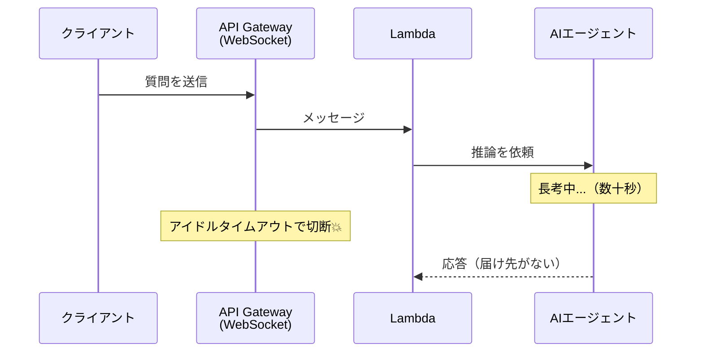
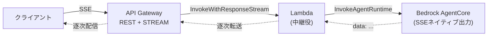

## TL;DR

- 生成AIチャットの通信を **WebSocket → SSE（Server-Sent Events）** に移行するための技術調査をした
- **「API Gateway は SSE 不可」は過去の話**。2025-11 に REST API のレスポンスストリーミングが GA し、`STREAM` 転送モードで `text/event-stream` を逐次配信できる
- 調べていくと、**本当のボトルネックは API Gateway ではなく Lambda 側**だった。Lambda のネイティブレスポンスストリーミングは **Node.js マネージドランタイム限定**で、**Python は非対応**（Lambda Web Adapter 等が必要）
- 結論は **「API Gateway REST API（STREAM）＋ ストリーミング対応 Lambda で、Bedrock AgentCore が出力する SSE を中継する」** 構成を第一候補に採用

## この記事の対象読者

- AWS 上で**生成AIチャットのストリーミング応答**を実装したい方
- API Gateway と SSE の**最新の対応状況・制約**を知りたい方
- WebSocket のタイムアウト切断に悩んでいて、SSE 移行を検討している方

:::message
本記事は **AI開発基盤シリーズ（全3回）の第3回**です。
1. [Claude Code と Codex の設定を1つのSSOTに統一する](#) — APMでエージェント設定を統一
2. [増えすぎたMCPサーバーを「許可リスト」で統制する](#) — MCPの台帳・ガバナンス
3. **API GatewayでSSE、本当の壁はLambdaがPython**（本記事）
:::

:::message
この記事は実装前の**技術調査（スパイク）の記録**です。AWS 公式ドキュメントの一次情報に基づく制約整理と方針決定が中心で、PoC で検証すべき項目も最後に明記しています。
:::

## 背景：WebSocket の「長考中の切断」を解消したい

私たちが開発している生成AIアシスタントは、クライアント（Flutter アプリ）と AWS Lambda の間を **API Gateway の WebSocket** で接続していました。

これが、生成AI特有の問題を抱えていました。**エージェントが長考している間に接続が切れる**のです。

WebSocket のアイドルタイムアウトが原因です。エージェントの推論が長引くと、その間メッセージが流れないため「アイドル」と判定され、接続が切られてしまう。生成AIのように**応答生成に時間がかかるワークロードとは相性が悪い**のです。

そこで、通信を **SSE（Server-Sent Events）** に切り替える方針を立てました。SSE ならサーバーからトークンを逐次プッシュでき、途中で keep-alive を送ってアイドル切断も防げます。生成AIチャットのストリーミング表示にはうってつけです。

ただし、一つ大きな不安がありました。**「API Gateway って、SSE 使えたっけ？」**

## 誤解：「API Gateway は SSE 不可」は過去の話

結論から言うと、**使えます。** ただし、これは比較的最近の話です。

かつての API Gateway は、次の理由で SSE に向かないと言われていました。

- **29 秒の統合タイムアウト**があった
- レスポンスを**バッファリング**してから返すため、逐次配信ができなかった

ところが **2025-11 に REST API のレスポンスストリーミングが GA** し、状況が変わりました。統合レスポンスの転送モードに `STREAM` が追加され、**完全なレスポンス確定を待たずにクライアントへ逐次送出**できるようになったのです。AWS の公式ユースケースにも「SSE」「生成AIチャットボットの TTFB（Time To First Byte）改善」が明記されています。

つまり **API Gateway 側に致命的なブロッカーはもう無い**、というのが最初の発見でした。

### API Gateway の SSE 対応（STREAM 転送モード）の制約一覧

とはいえ制約はあります。AWS 公式ドキュメントから整理したのが次の表です。

| 項目 | 内容 |
| --- | --- |
| 対応 API タイプ | **REST API のみ**（HTTP API は非対応） |
| 対応統合タイプ | `AWS_PROXY`（Lambda プロキシ）/ `HTTP_PROXY` のみ |
| 既定 / 有効化 | 既定は `BUFFERED`。`STREAM` への変更が必要 |
| ストリーミング方向 | **レスポンスのみ**（リクエストストリーミングは非対応） |
| 最大ストリーミング時間 | **15 分** |
| アイドルタイムアウト | **Regional: 5 分** / Edge-optimized: 30 秒 |
| 29 秒統合タイムアウト | STREAM では**超過可能** |
| STREAM で使えない機能 | **エンドポイントキャッシュ / 圧縮 / VTL によるレスポンス変換** |
| 認証 | リクエスト系オーソライザ（Lambda Authorizer 等）は統合実行前に動くため**併用可** |

ポイントは、**アイドルタイムアウトが Regional で 5 分に伸びる**こと。WebSocket 時代より格段に余裕があり、keep-alive コメントを併用すれば長考中の切断は現実的に回避できます。

## 本当の壁：Lambda が Python だとネイティブストリーミングできない

API Gateway が SSE に対応していると分かって安心したのも束の間、**もっと手前に壁**がありました。

API Gateway の `STREAM` は、内部で `InvokeWithResponseStream` という API を使って Lambda を呼びます。つまり **Lambda 自体がストリーミング対応でなければならない**。そして、ここに落とし穴がありました。

| 項目 | 内容 |
| --- | --- |
| 対応ランタイム | **Node.js マネージドランタイムはネイティブ対応**／**Python は非対応** |
| Python でやるには | **Lambda Web Adapter** かカスタムランタイムが必要 |
| ペイロード上限 | ストリーミング時 最大 **200 MB**（バッファ時は 6 MB） |
| VPC | Function URLs は VPC 内ストリーミング非対応 |
| 課金 | クライアント切断でも関数は中断されず、全実行時間分が課金対象 |

私たちの Lambda は **Python** です。そして Lambda のネイティブレスポンスストリーミングは、記事執筆時点で **Node.js マネージドランタイムしか対応していません**。

> 最大の実装上の制約は、API Gateway 側ではなく **Lambda 側（Python 非対応）** だった。

これが調査で一番の学びでした。「API Gateway が SSE できるか」ばかり気にしていたら、本当のボトルネックを見逃すところだったのです。Python でストリーミングするには **Lambda Web Adapter**（Web アプリを Lambda 上で動かすためのアダプタ）を挟むなどの工夫が要ります。ここが PoC の主眼になりました。

## 設計の本質：エージェントの SSE を「中継」するだけ

もう一つ重要な発見がありました。推論を担う **Amazon Bedrock AgentCore Runtime は、そもそも SSE をネイティブ出力する**のです。

`InvokeAgentRuntime` を呼ぶと、応答を**リアルタイムにチャンク配信**してくれます。`text/event-stream` なら `data:` 行に JSON を載せて返す、まさに SSE そのものです。

つまりエージェントの応答は**元から SSE**。移行の本質は「新しくストリーミングを実装する」ことではなく、**「AgentCore が出す SSE を、認証を担保しながらクライアントまで中継する」**ことだと整理できました。認証は JWT（Bearer）と Firebase App Check で、これらは API Gateway のオーソライザが統合実行の前に動くため、STREAM でも併用できる見込みです。

問題を「実装」から「中継」と捉え直せたことで、設計がぐっとシンプルになりました。

## 代替案の比較

第一候補を決める前に、SSE を実現しうる4案を比較しました。

| 観点 | ① API Gateway REST + STREAM | ② Lambda Function URLs | ③ ALB + Lambda/コンテナ | ④ AppSync |
| --- | --- | --- | --- | --- |
| SSE 実現 | ◯（GA・SSE 明記） | ◯（200 MB・低レイテンシ） | ◯（コンテナなら自由） | △（GraphQL 購読で擬似的） |
| 既存 API Gateway 構成の維持 | ◎ そのまま | △ 別経路 | △ 別経路 | △ 別経路 |
| 認証（Bearer + App Check） | ◯ オーソライザ併用可 | △ IAM / NONE のみ | ◯ ターゲット側で自由 | △ Cognito/Lambda 認可へ寄せる |
| タイムアウト | アイドル5分／最大15分 | 関数タイムアウト最大15分 | ALB は調整可・長時間可 | 接続を長時間維持 |
| Python 対応 | Web Adapter 等が必要 | 同左（+ VPC 非対応） | コンテナなら制約小 | リゾルバ次第 |
| 運用・監視の一本化 | ◎ 既存と同経路 | △ | △ | △ |

比較すると **① API Gateway REST + STREAM** が総合的に優位でした。決め手は次の2点です。

- **既存の API Gateway・認証・監視の経路をそのまま活かせる**（移行リスクが小さい）
- **認証（Bearer + App Check）をオーソライザで併用できる**

② Function URLs は 200 MB ペイロードと低レイテンシが魅力ですが、**認証を単体で担保しづらく（IAM/NONE のみ）**、**VPC 非対応**で、API Gateway のスロットル・WAF・監視を失う点が弱点でした。

## 推奨方針と、PoC で潰すべき残課題

### 第一候補

> **API Gateway REST API（STREAM 転送モード）＋ ストリーミング対応 Lambda で、AgentCore の SSE を中継する。**

WebSocket のアイドル切断問題は、SSE のアイドルタイムアウト（Regional 5 分）＋ keep-alive コメント送出で回避します。要対応は **Python Lambda のストリーミング化**で、ここが PoC の中心です。

### PoC で検証する残課題

調査はあくまで机上の整理です。次の点は実機で確認しないと断定できません。**未検証を「できる」と言い切らない**のが、この手の技術選定では大事だと考えています。

- [ ] Python Lambda のレスポンスストリーミングを **Lambda Web Adapter** で実現し、API Gateway STREAM 統合経由で `text/event-stream` がクライアントまで逐次届くか
- [ ] **Bearer + Firebase App Check のオーソライザ**が STREAM 統合と問題なく併用できるか
- [ ] 利用リージョンで API Gateway / Lambda のレスポンスストリーミングが利用可能か
- [ ] アイドル 5 分・最大 15 分のタイムアウトが、エージェント最長応答時間に対し十分か（keep-alive 設計含む）
- [ ] STREAM で失われる機能（キャッシュ / 圧縮 / VTL）が現行構成に影響しないか

## まとめ

- **「API Gateway は SSE 不可」は過去の話**。2025-11 の REST API レスポンスストリーミング GA で、`STREAM` 転送モードにより SSE が成立する
- ただし**本当のボトルネックは Lambda 側**だった。ネイティブストリーミングは Node.js 限定で、**Python は Lambda Web Adapter 等が必要**
- 生成AIの応答（Bedrock AgentCore）は**元から SSE**。設計の本質は実装ではなく**「認証を担保した中継」**だと捉え直せた
- 「A ができるか」だけでなく、**その前提となる B・C の制約まで一次情報で潰す**——生成AI × AWS のように動きの速い領域ほど、この地道な調査が効く

生成AIチャットのストリーミングは、まさに今 AWS の機能が追いついてきている領域です。同じ WebSocket → SSE 移行を検討している方の一助になれば幸いです。PoC の結果は続編で書く予定です。

## 関連記事（AI開発基盤シリーズ）

- 第1回: **Claude Code と Codex の設定を1つのSSOTに統一する - APMでAIエージェント設定をコード管理した話**
- 第2回: **増えすぎたMCPサーバーを「許可リスト」で統制する - registry.yamlをSSOTにしたMCPガバナンス基盤**

なお、本記事の SSE 化はより大きな**4ステップのアーキテクチャ移行**の一部（Step2）です。全体像はこちら:

- **本番稼働中の生成AIシステムを4ステップで段階移行する - 「MCP経由で遅い」を解くアーキテクチャ移行ADR**

## 参考リンク

- [Stream the integration response for your proxy integrations in API Gateway](https://docs.aws.amazon.com/apigateway/latest/developerguide/response-transfer-mode.html)
- [Amazon API Gateway now supports response streaming for REST APIs（2025-11 GA）](https://aws.amazon.com/about-aws/whats-new/2025/11/api-gateway-response-streaming-rest-apis/)
- [Response streaming for Lambda functions](https://docs.aws.amazon.com/lambda/latest/dg/configuration-response-streaming.html)
- [Stream agent responses - Amazon Bedrock AgentCore](https://docs.aws.amazon.com/bedrock-agentcore/latest/devguide/response-streaming.html)
- [Building responsive APIs with Amazon API Gateway response streaming（AWS Compute Blog）](https://aws.amazon.com/blogs/compute/building-responsive-apis-with-amazon-api-gateway-response-streaming/)
- [AWS Lambda Web Adapter - GitHub](https://github.com/awslabs/aws-lambda-web-adapter)
