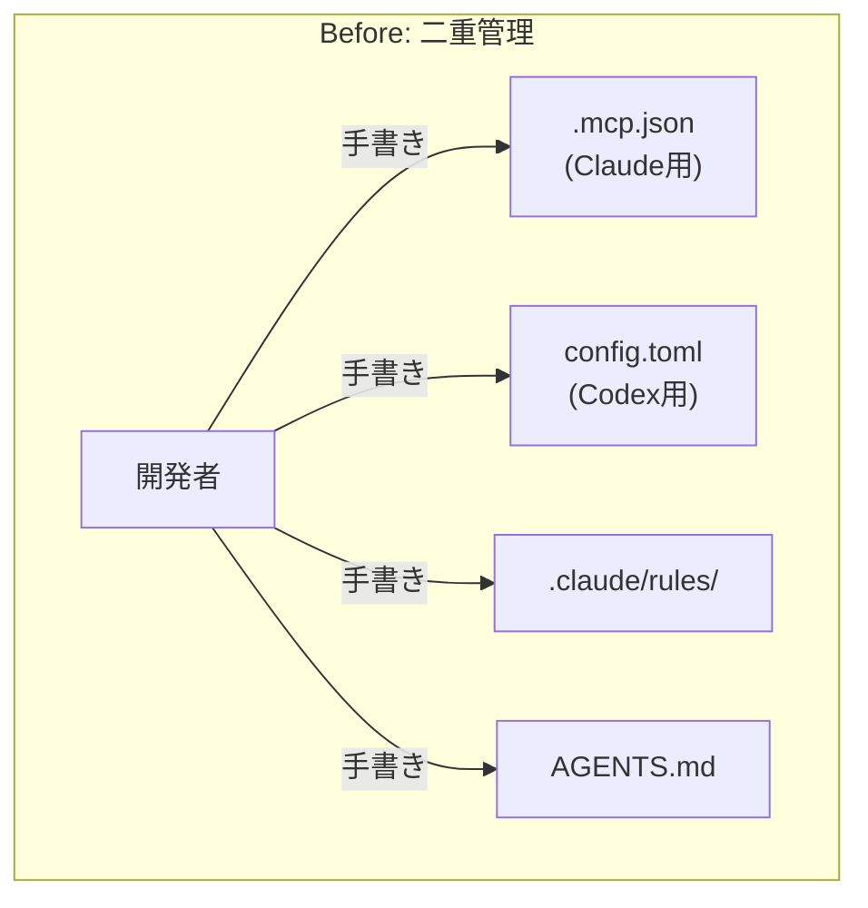
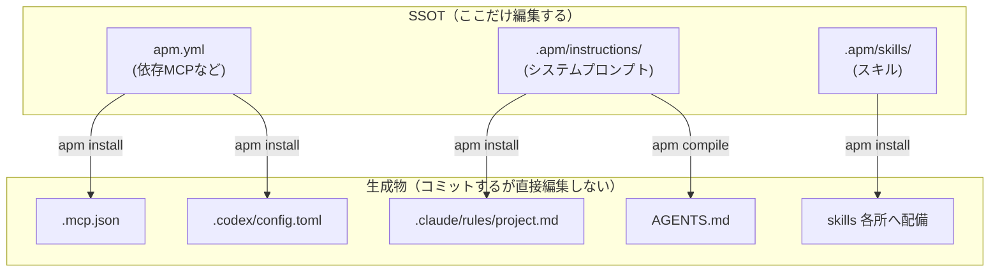

## TL;DR

- Claude Code と Codex を併用していたら、**MCP・システムプロンプト・スキルの設定が二重管理**になり、片方だけ更新されるズレが頻発した
- [APM（Agent Package Manager）](https://github.com/microsoft/apm) を導入し、`apm.yml` + `.apm/` を**唯一の正（SSOT）**に。各ツールのネイティブ設定（`.mcp.json` / `AGENTS.md` / `.claude/rules/` / スキル）は**すべて生成物**にした
- 「編集する場所」が2ツール分から**1か所**になり、CIで**生成物のドリフト（再生成し忘れ）を自動検知**できるようになった
- ハマったのは「ツール間で共有できる設定／できない設定の線引き」。**権限・セキュリティ設定は共有せず、ツール個別で管理**するのが結論

## この記事の対象読者

- Claude Code や Codex など、**複数のAIコーディングエージェントを併用**している方
- MCP サーバーの設定をチームで共有・管理したい方
- AIエージェントの設定を「Docs as Code」的に**バージョン管理・レビュー対象**にしたい方

:::message
本記事は **AI開発基盤シリーズ（全3回）の第1回**です。
1. **APMでエージェント設定を統一する**（本記事）
2. [増えすぎたMCPサーバーを「許可リスト」で統制する](#) — MCPの台帳・ガバナンス
3. [API GatewayでSSEはできる、本当の壁はLambdaがPythonだったこと](#) — 生成AIランタイムの技術調査
:::

## 背景：AIエージェントの設定が二重管理になっていた

私たちのチームでは、AIコーディングエージェントとして **Claude Code をメイン、Codex をサブ**で併用しています。
どちらも「MCP サーバー」「システムプロンプト（プロジェクト共通の指示）」「スキル（定型作業のワークフロー）」を設定できますが、**設定ファイルの形式がツールごとに違う**のが悩みでした。

| 設定の種類 | Claude Code | Codex |
| --- | --- | --- |
| MCP サーバー | `.mcp.json` | `.codex/config.toml` |
| システムプロンプト | `.claude/rules/*.md`（自動読込） | `AGENTS.md`（直接参照） |
| スキル | `.claude/skills/` | `.agents/skills/` |

同じ内容を**2つの形式で手書きして同期させる**必要があり、次のような問題が起きていました。

- MCP サーバーのバージョンを上げたのに、Codex 側の TOML を更新し忘れる
- システムプロンプトに「コミットメッセージ規約」を足したが、片方のツールにしか反映されていない
- 新メンバーが「どっちのファイルが正なの？」と迷う

要するに **SSOT（Single Source of Truth）が存在しない**状態でした。AIエージェントの設定は、いまやコードと同じくらいチームの生産性を左右します。ここが二重管理なのは看過できませんでした。



## 技術選定：なぜ APM なのか

解決策として採用したのが、Microsoft が公開している **APM（Agent Package Manager）** です。

### APM とは

[APM](https://github.com/microsoft/apm) は、AIエージェントの設定（MCP・インストラクション・スキルなど）を**プリミティブ（部品）として一元定義**し、そこから各ツールのネイティブ設定を**生成・配備**するためのツールです。npm がパッケージを管理するように、「エージェント設定」を管理するイメージです。

### APM を選んだ3つの理由

#### 1. 「1つの定義 → 複数ツールへ配備」がそのまま実現できる

`apm.yml`（依存する MCP など）と `.apm/`（インストラクション・スキルの実体）を書けば、`apm install` / `apm compile` で Claude Code 用と Codex 用の設定を**両方まとめて生成**してくれます。まさに私たちが欲しかった SSOT → 派生の構造です。

#### 2. 生成物をコミットすれば「利用するだけなら CLI 不要」

生成された `.mcp.json` や `AGENTS.md` をリポジトリにコミットしておけば、**設定を使うだけのメンバーは APM CLI を入れる必要がありません**。設定を変更する人だけが CLI を入れて再生成すればよい。導入のハードルが低いのが決め手でした。

#### 3. 設定を「レビュー可能な差分」にできる

すべてがファイルなので、設定変更が Pull Request の差分として現れます。「なぜこの MCP を足したか」をレビューで議論できる。AIエージェント設定を Docs as Code の土俵に乗せられます。

## 実装：SSOT から各ツール設定を生成する

### 全体像



ポイントは **「編集するのは左側（SSOT）だけ」「右側（生成物）は触らない」** というルールです。

### SSOT の中身

`apm.yml` に MCP サーバーの依存を宣言します。

```yaml
# apm.yml（抜粋）
name: my-ai-assistant
version: 1.0.0
targets:
  - claude
  - codex
dependencies:
  mcp:
    - name: apidog-lambda
      transport: stdio
      command: npx
      args:
        - -y
        - apidog-mcp-server@0.0.17   # バージョンは固定（@latest は使わない）
        - --project=XXXXXXX
      env:
        APIDOG_ACCESS_TOKEN: ${APIDOG_ACCESS_TOKEN}  # 実値は環境変数
    - name: atlassian
      transport: stdio
      command: npx
      args:
        - -y
        - mcp-remote@0.1.38
        - https://mcp.atlassian.com/v1/mcp/authv2
includes: auto
```

システムプロンプトは `.apm/instructions/project.instructions.md` に Markdown で書きます。これ1ファイルが、Claude Code 用の `.claude/rules/project.md` と Codex 用の `AGENTS.md` の**両方に展開**されます。

スキルは `.apm/skills/<name>/SKILL.md` に置きます。私たちは PR 作成・差分レビュー・Jira チケット生成・MCP バージョンチェックなどを定義しています。

### 生成コマンドを Makefile に集約

コマンドを覚えなくていいように、`Makefile` にまとめています。

```makefile
# 生成物の再現性のため、CI とローカルで APM バージョンを揃える
APM_VERSION := 0.16.1

apm-install:   # apm.yml/.apm を各ツールへ配備（MCP/skills/rules + lock 生成）
	apm install

apm-compile:   # .apm/instructions から AGENTS.md（Codex 用）を生成
	apm compile -t codex --no-links --single-agents

apm-sync: apm-install apm-compile   # AI 設定を全再生成（.apm を編集したら実行）

apm-verify: apm-sync   # 生成物が SSOT と整合しているか検査（CI と同じ）
	apm audit --ci --no-drift
```

**運用はシンプルです。`.apm/` か `apm.yml` を編集したら `make apm-sync` を叩くだけ。** これで両ツールの設定が一斉に再生成されます。

### CI で「再生成し忘れ」を自動検知する

このワークフローの弱点は「SSOT を編集したのに `make apm-sync` を忘れる」ことです。すると生成物が古いままコミットされ、SSOT と生成物がズレます。

そこで **CI で生成物のドリフトを検知**します。CI 上でもう一度生成し、差分が出たら失敗させる仕組みです。

```yaml
# .github/workflows/ci.yml（抜粋）
jobs:
  apm-verify:
    runs-on: ubuntu-latest
    steps:
      - uses: actions/checkout@v4
      - name: Install APM CLI
        uses: microsoft/apm-action@v1
        with:
          apm-version: "0.16.1"   # ローカルと固定
          setup-only: true

      - name: APM audit (baseline checks)
        run: apm audit --ci --no-drift

      # 再生成し忘れ（make apm-sync 忘れ）を検出
      - name: Verify generated files are in sync
        run: |
          apm install
          apm compile -t codex --no-links --single-agents
          git diff --exit-code -- \
            AGENTS.md .mcp.json .codex .claude/rules .claude/skills .agents/skills
```

`git diff --exit-code` で「再生成しても差分が出ない＝同期済み」を保証します。生成物の `Build ID` はコンテンツハッシュで決まる決定的な値なので、**内容が同じなら差分は出ません**。

## ハマったところと解決策

### 1. 「共有できる設定」と「できない設定」の線引き

一番の学びがこれです。**すべてを共有しようとして失敗しました。**

権限・セキュリティ設定（どのコマンドを許可するか等）は、Claude Code では `.claude/settings.json`、Codex では `approval_policy` / `sandbox_mode` と、**概念からして噛み合いません**。そもそも APM の管理対象外でもあります。

結論として、共有する／しないを次のように割り切りました。

| 設定の種類 | SSOT で共有 | 備考 |
| --- | --- | --- |
| MCP サーバー | ✅ | 形式差はあれど内容は同じ |
| システムプロンプト | ✅ | Markdown をそのまま両ツールへ |
| スキル | ✅ | 配備先だけ違う |
| **権限・セキュリティ** | ❌ | **ツール個別で管理**。概念が異なる |

「無理に統一しない」判断も設計のうち、というのが得た教訓でした。

### 2. TOML のキーにドットが使えない

MCP サーバー名に `apidog.lambda` のようにドットを入れたら、Codex 用の `config.toml` 生成で壊れました。TOML ではドットがテーブルの区切りになるためです。**サーバー名はハイフン区切り（`apidog-lambda`）**に統一して回避しました。

### 3. AGENTS.md は Codex ターゲットで生成する

`apm compile` の `-t claude` で `AGENTS.md` を作ると、Claude 用には**空のスタブ**が生成されてしまいました。Claude Code はシステムプロンプトを `.claude/rules/` から自動で読み込むので `AGENTS.md` を必要としないためです。

そこで **`AGENTS.md` の生成は `-t codex` 単体**で行うようにしました（`apm compile -t codex`）。ツールごとに「どの生成物が要るか」を理解して、生成ターゲットを絞るのがコツです。

### 4. 秘匿情報は生成物に焼き込まない

MCP のアクセストークンなどの秘匿情報は、`apm.yml` には **`${APIDOG_ACCESS_TOKEN}` というプレースホルダだけ**を書きます。実値は各自の `~/.zshrc` 等で環境変数として定義します。こうすれば生成される `.mcp.json` や `config.toml` にも**平文で焼き込まれず**、そのままコミットできます。

### 5. APM のバージョンをローカルと CI で固定する

生成物は APM のバージョンによって微妙に変わり得ます。ローカルでは古い APM、CI では新しい APM、だと**永遠に差分が消えない**事故が起きます。`Makefile` と CI の両方で `APM_VERSION` を明示的に固定して揃えました（記事執筆時点では `0.16.1`）。`@latest` は使いません。

## 成果：編集は1か所、ズレはCIが弾く

### Before / After

| 項目 | Before | After |
| --- | --- | --- |
| 設定を編集する場所 | Claude 用と Codex 用で**2系統**を手書き同期 | **`.apm/` + `apm.yml` の1か所** |
| ツール間のズレ | 手作業依存で頻発 | `make apm-sync` で一斉反映 |
| 再生成し忘れ | 気づけない | **CI が差分検知で失敗させる** |
| 新メンバーのオンボード | 「どっちが正？」問題 | SSOT を見れば分かる／CLI すら不要 |

数字にしづらい改善ではありますが、体感で一番効いたのは「**設定変更の心理的コストが下がった**」ことです。1か所直して `make apm-sync`、あとは CI が守ってくれる。だから MCP のバージョン更新やプロンプト改善を気軽に PR できるようになりました。

## まとめ

- 複数のAIエージェント（Claude Code / Codex）を併用するなら、設定の SSOT 化は投資に見合う
- **APM で `apm.yml` + `.apm/` を唯一の正**にし、各ツールのネイティブ設定は生成物として扱う
- **生成物をコミット**しておけば、利用するだけのメンバーは CLI 不要
- **CI で再生成ドリフトを検知**すれば、「同期し忘れ」を仕組みで防げる
- ただし**権限・セキュリティ設定は無理に共有せず、ツール個別に**。共有できるもの／できないものの線引きが設計の勘所

AIエージェントの設定は、これからますますチームの共有資産になっていきます。「プロンプトも MCP もスキルも、コードと同じようにバージョン管理・レビューする」——その第一歩として、APM は有力な選択肢でした。

## 関連記事（AI開発基盤シリーズ）

- 第2回: **増えすぎたMCPサーバーを「許可リスト」で統制する - registry.yamlをSSOTにしたMCPガバナンス基盤**
- 第3回: **API GatewayでSSEはできる、本当の壁はLambdaがPythonだったこと - 生成AIチャットのWebSocket→SSE移行 技術調査**

## 参考リンク

- [APM（Agent Package Manager） - GitHub](https://github.com/microsoft/apm)
- [Model Context Protocol（MCP）公式](https://modelcontextprotocol.io/)
- [Claude Code ドキュメント](https://docs.anthropic.com/en/docs/claude-code/overview)
