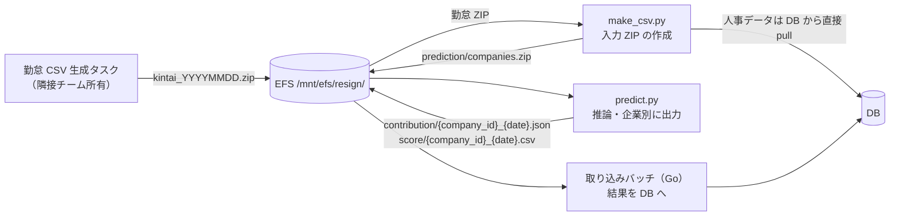
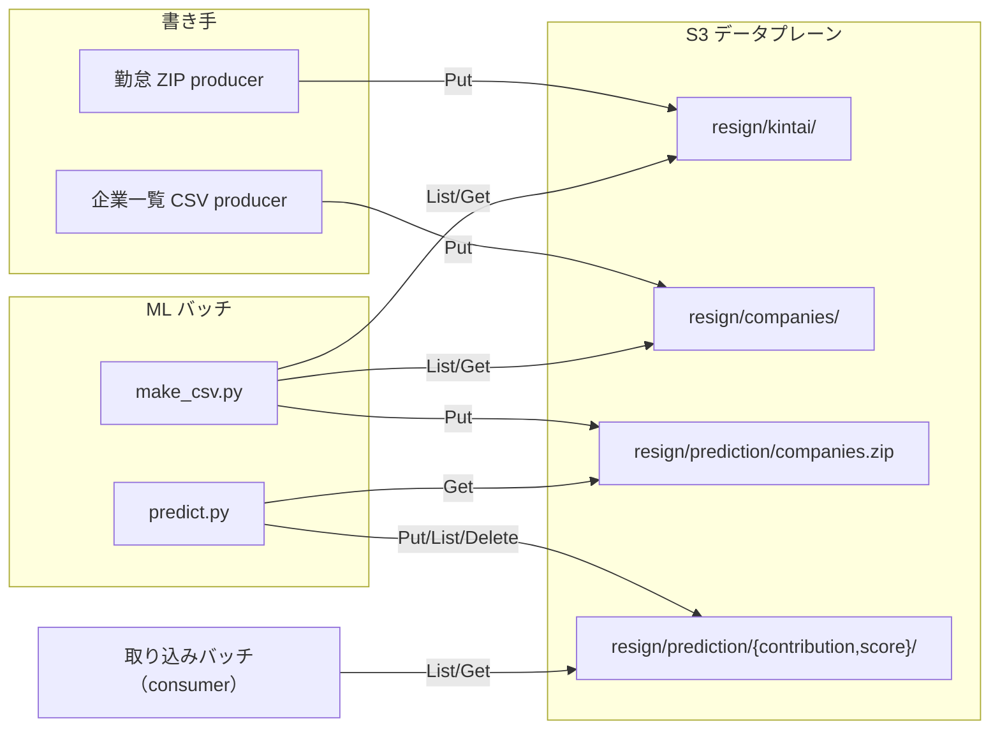
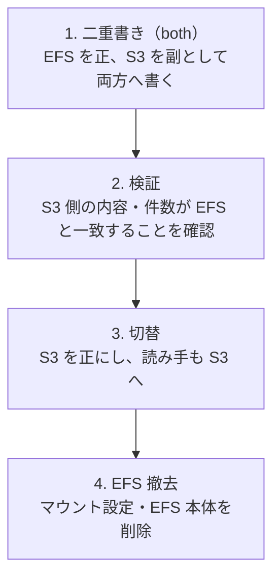

> **執筆メモ（公開前に消す）**: 本文は完了形で書いていますが、執筆時点（2026-10-04、Jira で確認）では本番の S3 単独切替までが完了で、旧ステートマシンの停止・削除と EFS 本体の撤去が Open、ADR も Proposed のままです。撤去完了と ADR の Accepted 化を待って公開してください。本番の契約企業数 N は一次情報に無く、本文では N を記号のまま扱っています（開発環境の実測 22〜23 社のみ記載）。切替当日のダウンタイムはバッチ基盤のため該当なし。
> **テックブログイベント候補**

## TL;DR

- ML バッチの共有ストレージを **EFS から S3 へ移行**しました。ストレージ単価は 14.4 倍差、月額は 92% 減です
- ところが削減額を実測すると**年 1.19 ドル**でした。対象データが 1 GiB にも満たないためです
- それでも移行しました。本当の価値は**監査（CloudTrail data events）と PII 保持設計（Lifecycle TTL）**にあったからです
- 「EFS を選んだ理由」を関係者に聞いたら、POSIX 共有もロックも使っていませんでした。EFS を選ぶ積極的理由は最初から無かったのです
- 二重書き → 検証 → 切替 → 撤去の段階移行で、設計から本番切替まで約 2 か月でした
- おまけで、「スコープを縮めてリリースしたら受け皿チケットが消えて、Jira は完了なのに本番は EFS のまま、に 2 週間気づかなかった」失敗談も書きます

## この記事の対象読者

- ML バッチや日次バッチの共有ストレージに EFS を使っている方
- S3 化を「コスト削減」で起案しようとしている方
- PII（個人情報）を含むファイルの保持期間や監査をどう設計するか悩んでいる方
- ADR（Architecture Decision Record）で「却下した案」と「決定の根拠」を残す運用に興味がある方

## 環境

- AWS 東京リージョン（開発環境のみ別リージョン）
- Amazon EFS（Elastic Throughput）→ Amazon S3（SSE-KMS、バージョニング有効）
- Python 3 系 + boto3（ML バッチ）、Go（取り込みバッチ）
- AWS Step Functions + ECS Fargate（バッチのオーケストレーション）
- Terraform（インフラ）

## 背景：ML バッチの受け渡しが EFS 前提だった

私たちのチームは、人事データから離職リスクを予測する ML バッチを運用しています。学習と推論は Step Functions のステートマシンから ECS タスクとして実行され、タスク間のデータ受け渡しは **DB ではなくファイル**で行います。その置き場が EFS でした。



EFS 上のファイルを棚卸しすると、依存箇所は 11 個でした。性質で分けると 3 種類です。

| 種類 | 内容 | 規模 |
| --- | --- | --- |
| 入力 | 勤怠 ZIP、学習用の企業一覧 CSV | 1 日 1 ファイル |
| 中間 | 学習用・推論用のマージ済み ZIP | 1 実行 1 ファイル |
| 出力 | 企業別の寄与度 JSON とスコア CSV | **2 × N 個の小ファイル**（N = 契約企業数） |

大半は 1 本の大きな ZIP で、多数の小ファイルになるのは推論結果の出力だけです。この構造が、後の性能評価で効いてきます。

以前の ADR では、この EFS を「共有可変状態・POSIX 前提の既存コードに適合するから」という理由で**暫定的に**妥当としていました。同時に、「EFS → S3 への移行余地を明示的に残す」と書き、コストとスループットの実測比較を未確定論点として積んでいました。今回はその宿題を片付ける設計です。

## 「EFS を選んだ理由」を関係者に確認したら前提が崩れた

設計の最初にやったのは、コードを読むことではなく**聞くこと**でした。勤怠 ZIP を置いている隣接チームと、インフラ担当に「なぜ EFS なのか」を確認しました。

返ってきた答えはこうです。

1. EFS 採用に**特殊要件は無い**。選んだ理由は「S3 よりネットワーク起因の read/write 失敗を考えなくてよく、コードが簡単になるから」
2. バッチは**追記せず、ファイルの新規作成のみ**。共有可変状態は存在しない
3. インフラ担当の唯一の懸念は「**小さいファイルを大量に read/write するときの S3 性能**」。それがクリアなら S3 で差し支えない

つまり、前の ADR が EFS 継続の根拠にしていた「POSIX 共有・可変状態」は、このワークロードに**存在しませんでした**。追記もロックも rename も使っていません。EFS を選ぶ積極的理由は消え、残ったのは「監査と保持設計の面で S3 が優位」という状況だけです。

ここで学んだのは、**既存の設計判断の根拠は、ドキュメントではなく当事者に聞くと崩れることがある**という点です。前の ADR は「既存コード適合」を推定で書いていました。実際にコードを書いた人に聞けば 1 往復で済む話でした。

## インフラ担当の懸念「小ファイル大量 I/O」を規模で答える

残った懸念は性能です。「S3 は小さいファイルを大量に扱うと遅い」という評判は正しいのですが、問題は**どの規模から**かです。感覚ではなく、S3 の公開仕様と自分たちのワークロードを並べて答えました。

| 観点 | S3 の仕様 | 本ワークロード | 判定 |
| --- | --- | --- | --- |
| リクエスト上限 | プレフィックスあたり 3,500 PUT/s・5,500 GET/s | 日次バッチで逐次 2 × N 件の PUT | 桁違いの余裕 |
| PUT レイテンシ | 1 オブジェクト概ね数十 ms | N = 2,000 でも逐次で数十秒〜約 2 分 | 推論の計算時間に埋もれる |
| 下流の読み取り | 単一オブジェクトのランダム GET が得意 | 企業単位で 1 ファイル取得 | **EFS より S3 向き** |
| 整合性 | write-after-read が強整合（2020 年 12 月以降） | producer → consumer の受け渡し | 問題なし |

「多数小ファイルで S3 が不利」になるのは、毎秒数千 PUT を並列で叩き続けるような規模です。日次・逐次・2 × N 件という使い方とは無縁でした。

契約企業数 N の実数はコードからは取れませんでしたが、結論は「N が数千程度まで問題なし」という形で N に依存しません。N が数万規模になった場合だけ、プレフィックス分散と並列 PUT を検討する、と ADR に条件付きで残しました。

## Mountpoint for S3 を本命にしなかった理由

S3 に移すとして、方式は 2 つあります。ファイルシステムとしてマウントする **Mountpoint for S3** と、SDK で直接叩く **boto3 直**です。既存コードがパス前提なら Mountpoint が最小改修に見えます。

| 観点 | boto3 直 | Mountpoint for S3 | EFS 継続 |
| --- | --- | --- | --- |
| 新規作成の書き込み | ◎ PutObject | ○ 逐次書き込み可 | ◎ |
| list + 旧ファイル削除 | ◎ ListObjectsV2 + DeleteObjects | ○ FS 経由で可 | ◎ |
| 追記・rename | ✕（不要） | ✕ 非対応（不要） | ◎（不要） |
| 既存コードの適合 | △ FS 呼び出しを SDK へ書き換え | ◎ パス前提のまま | ◎ |
| 追加インフラ | ◎ boto3 は既存依存 | △ マウント運用が増える | ◎ |
| 監査・保持 | ◎ data events / Lifecycle | ○ | ○ |

**boto3 直を第一にしました。** 理由は 3 つです。

1. 必要な操作は **PutObject / GetObject / ListObjectsV2 / DeleteObjects の 4 つ**だけで、SDK へ素直に写せる
2. boto3 は成果物配布で既に使っている依存であり、新しいものを増やさない
3. 下流の読み取りは「キーの分かっている単一オブジェクトを都度取得」で、FUSE を挟む価値が無い。Mountpoint は本来、大きなファイルの高スループット逐次読みに向いた道具です

Mountpoint は捨てたわけではなく、**改修が重い読み手に限った read-only のフォールバック**として残しました。Web 層へのマウントは非推奨、改修が現実的なら boto3、という判断ルールも先に決めておきました。実際には読み手の取り込みバッチ（Go）も AWS SDK for Go で改修でき、フォールバックは使っていません。

## S3 キーは EFS のレイアウトをそのまま踏襲した

キー設計で凝ったことはしていません。EFS のマウントルート `/mnt/efs` をバケットルートに対応させ、**論理パスを 1 文字も変えませんでした**。

```text
/mnt/efs/resign/prediction/contribution/{company_id}_{yyyymmdd}.json
        ↓
s3://<bucket>/resign/prediction/contribution/{company_id}_{yyyymmdd}.json
```

producer と consumer の差分を最小にするためです。「ストレージを変える」と「レイアウトを変える」を同時にやると、問題が起きたときにどちらが原因か切り分けられません。

バケットは機能横断で 1 つにし、機能はトップレベルプレフィックス（`resign/`、将来の `survey/` など）で分けました。機能別バケット案は、機能追加のたびにバケット・監査・暗号化設定が増殖するため不採用です。アクセス分離は IAM のプレフィックス条件で実現できます。

## 本当の価値は監査と保持設計にあった

ここが本題です。EFS 時代に**できなかった**ことが、S3 では設計として明示的に書けるようになりました。

### IAM を producer / batch / consumer で分離する

アクター単位のカスタマー管理ポリシーを 4 つ作り、既存の ECS タスクロールに付与しました。



ポイントは**与えない権限**です。

- producer に `s3:DeleteObject` は与えない。新規作成のみと確認済みで、上書きや削除は producer の責務ではないため
- consumer は読み取りのみ。`kms:Decrypt` は持つが `kms:GenerateDataKey` は持たない
- `s3:ListBucket` はバケット単位の許可なので、`s3:prefix` 条件で対象プレフィックスに限定する

EFS では「マウントできる = 全部読み書きできる」でした。誰が何をできるかを、Terraform の差分としてレビューできるようになったのが最大の変化です。

### SSE-KMS を「強制」する

PII を含むバケットなので、環境ごとのカスタマー管理キー（CMK）で SSE-KMS を使います。ただし、**デフォルト暗号化を設定するだけでは不十分**でした。

デフォルト暗号化はリクエストヘッダーを上書きしません。`s3:PutObject` を持つ producer が `x-amz-server-side-encryption: AES256` を明示すると、そのオブジェクトは SSE-S3 で保存されます。この経路で入ったオブジェクトは `kms:Decrypt` 無しで読めるため、「CMK = IAM と独立した第 2 の境界」が成立しなくなります。

バケットポリシーで塞ぎました。

```json
{
  "Sid": "DenyIncorrectEncryptionHeader",
  "Effect": "Deny",
  "Principal": "*",
  "Action": "s3:PutObject",
  "Resource": "arn:aws:s3:::<bucket>/*",
  "Condition": {
    "Null": { "s3:x-amz-server-side-encryption": "false" },
    "StringNotEquals": { "s3:x-amz-server-side-encryption": "aws:kms" }
  }
}
```

`Null` 条件を併用しているのは、**ヘッダーが指定されている場合だけ**拒否するためです。これが無いと、ヘッダー無指定でデフォルト暗号化に委ねる正常系まで拒否されます。

KMS のキーポリシー側では、使用系アクション（`Decrypt` / `GenerateDataKey` 等）を**アカウント内の全プリンシパルに明示 Deny**し、名指しのロールだけを例外にしました。管理者は鍵を管理できるが復号はできない、という状態を作っています。使用ロールの追加は Terraform 変更としてレビューを通ります。

### Lifecycle で PII の滞在期間に上限を保証する

削除の一次責務はアプリ側にあります。`predict.py` が実行のたびに旧日付の結果ファイルを消します。Lifecycle はその**取り漏れを回収するバックストップ**です。二重に定義することで、アプリが壊れていても PII の滞在期間に上限が保証されます。

| プレフィックス | 種別 | TTL |
| --- | --- | --- |
| `resign/kintai/` | raw 入力（PII） | 90 日 |
| `resign/companies/` | 学習用企業一覧 | 90 日 |
| `resign/training/` | 学習用の中間成果物 | 30 日 |
| `resign/prediction/companies.zip` | 推論入力（中間） | 30 日 |
| `resign/prediction/{contribution,score}/` | 推論結果（PII） | 90 日 |

加えて、バージョニングの非現行版は 30 日で削除、未完了のマルチパートアップロードは 7 日で中止しています。IA や Glacier への移行はしません。データが小さく短命で、IA の最低保存期間 30 日に対して削減効果が無いためです。

EFS にはこの機能がありません。「解約した企業のファイルがいつまで残るか」という質問に、EFS 時代は「cleanup が動いていれば翌日」としか答えられませんでした。

### CloudTrail data events で「誰が読んだか」を記録する

環境ごとに data events 専用の trail を 1 つ作り、データプレーンバケットの read + write を記録します。配信先は別の監査ログバケットで、本番は 3 年保持です。

これで「誰が・いつ・どのオブジェクトを読んだか」が残ります。EFS では NFS マウント越しの read を記録する手段がありませんでした。コストは 10 万イベントあたり 0.10 ドルで、日次バッチの規模では実質無視できます。

この trail が、後述の「本当に S3 単独で完走したか」の証拠にもなりました。

## 二重書き → 検証 → 切替 → 撤去の cutover

いきなり切り替えずに、ロールバック可能な段階移行にしました。



勤怠 ZIP を書く隣接チームのストレージアダプタには、書き込み先と読み取り先それぞれに正・副の切替を持たせてもらいました。環境変数 1 つで S3 を正に指定できます。

二重書き期間中も Lifecycle はそのまま適用しました。EFS 側が正なので、S3 側の失効はリスクになりません。逆に、切替後に過去分を EFS からバックフィルする場合は注意が要ります。Lifecycle はオブジェクトの**作成日**基準なので、過去日付の名前でも投入時点から TTL が起算されます。

切替のレバーはすべて環境変数にしました。ML 側は入力元と出力先をそれぞれ `efs` / `s3` / `both` から選べ、取り込みバッチ側は読み取り元を `efs` / `s3` から選べます。未設定時の既定はどちらも EFS 側です。IAM の配線とバケットは先に 3 環境へ入れておき、切替当日は 2 リポジトリの `.env` を書き換える PR を同じリリース列車に載せるだけにしました。ロールバックも環境変数を `efs` に戻して再デプロイするだけです。

ADR の日付が 2026-07-08、本番で読み書きの正が S3 になったのが 2026-09-15 で、設計から本番まで約 2 か月でした。dev → staging → production の順に切り替えています。本番は 2 段に分け、9/15 に入力元と読み手を S3 へ倒し、出力は `both` のまま初回の完走を確認してから S3 単独にしました。初回だけは S3 と EFS の両方に成果物を残し、突合できる状態にしておきたかったためです。

## 失敗談：スコープを縮めてリリースしたら、受け皿が消えた

順調に見えますが、途中で「Jira 上は完了なのに本番は EFS のまま」という状態に 2 週間気づきませんでした。

cutover は「dev で実証 → cutover チケットで全環境へ展開と撤去」という 2 枚のチケットで進めていました。ところが**スコープの先送りが 2 段続きました**。

1. 8/21、dev での実証チケットが完了する際に、EFS マウントの除去・インフラ側の EFS 設定削除・staging と production への展開を「cutover チケットへ移す」として対象外にした
2. 8/24、受け取った cutover チケットが dev と staging の切替とコスト実測で完了する際に、「本番が S3 単独で完走すること」を「別タスクへ」、EFS 撤去を「本番切替タスクの完了に追随」としてさらに外へ出した
3. その「別タスク」「本番切替タスク」が起票されないまま、cutover チケットが 8/26 に完了になった

1 段目の先送りには技術的な理由がありました。ML のタスク定義は 3 つの family で EFS ボリュームを共用しており、3 つすべてが EFS 不要にならないとマウントを外せません。1 つは勤怠 ZIP を、1 つは学習入力をまだ EFS から読んでいました。インフラ側の EFS 設定も 3 環境共用のモジュールにあり、staging と production が EFS を参照している間は消せません。撤去は本質的に全環境の切替後の工程で、先送り自体は正しい判断です。

問題は、縮小して外に出した分の**受け皿チケットが起票されなかった**ことです。配下のチケットがすべて「完了」に見えるのに、本番は入力も出力も読み手も EFS のまま。9/9 に配下を棚卸しして初めて分かりました。しかも隣接チームの勤怠 ZIP だけが 9/15 に S3 へ切り替わる予定だったので、そこで止まれば「入力だけ S3、結果は EFS」になります。これは ADR で「二重運用が恒久化する」として**却下したハイブリッド案そのもの**でした。却下した案が、誰も決めないまま恒久化しかけていたわけです。

気づいた後にやったことは 2 つです。

1. **外に出した分の受け皿を同時に起票する**ルールにした。縮小リリースは悪くないが、残りがどこにあるかを Jira 上で辿れなければならない
2. Feature チケットに **DoD（Definition of Done）を 5 条件で明文化**した。「本番の新ステートマシンが S3 経路で完走している」「旧ステートマシンが停止・削除されている」「本番が S3 単独で完走している（証拠の取り方は次節）」「EFS のマウント・IAM・本体が撤去され、全環境で IaC の plan 差分がゼロ」「ADR が Accepted に更新され、実測結果が反映されている」の 5 つで、いずれも状態で検証できる条件です

「完了」をステータスではなく状態で定義し直した、と言い換えられます。

### 「S3 単独で完走した」証拠の取り方

DoD の 3 条件目「S3 単独で完走すること」をどう検証するかで、もう 1 つ学びがありました。

取り込みバッチは**対象ファイルが 0 件でも成功終了します**。日をまたいだリランで二重取り込みを防ぐための仕様です。つまり、ステートマシンが緑で終わっても「S3 から読んで DB に書いた」証拠にはなりません。読めずに 0 件で成功した可能性があるからです。

そこで CloudTrail data events を使いました。取り込みバッチのロールによる `ListObjects` の後に、企業数分の `GetObject` が記録されていることを確認し、これを完走の証拠にしました。dev での実証では、ML 側の `PutObject` が 23 件、取り込み側の `GetObject` が 22 件で、件数が対応していることまで見ています。監査のために入れた仕組みが、移行検証にも効いた形です。この確認手順は DoD の条件文にそのまま書き込みました。

## コスト実測：削減率 92%、削減額は年 1.19 ドル

cutover 検証に合わせて、2026-08-24 に実測しました。

### 単価（東京リージョン）

| 項目 | 単価 |
| --- | --- |
| EFS Standard ストレージ | $0.36 / GiB-月 |
| EFS IA ストレージ | $0.02 / GiB-月 |
| S3 Standard ストレージ | $0.025 / GB-月 |

EFS Standard と S3 Standard の単価比は **14.4 倍**です。ここまでは起案の補強材料どおりでした。

### 実データ量と月額

| 環境 | EFS Standard | EFS IA | EFS $/月 | S3 $/月 |
| --- | --- | --- | --- | --- |
| 開発 | 0.030 GiB | 0.011 GiB | 0.0109 | 0.0030 |
| ステージング | 0.217 GiB | 0.010 GiB | 0.0784 | 0.0057 |
| 本番 | 0.000 GiB | 0.904 GiB | 0.0181 | 0.0000 |
| **合計** | | | **0.107** | **0.009** |

削減率は 92% です。削減額は**月 0.098 ドル、年 1.19 ドル**です。

本番 EFS のデータは全量が IA 階層に落ちており、スループット課金も直近 14 日で 221 KB しか計測されていませんでした。本番の学習・推論はこの時点では旧構成での月次運用だったため、アクセス頻度の低いデータが IA に落ちきっていた形です。

### 感度分析

「今は小さいだけで、本番が日次稼働すれば効くのでは」という反論に備えて試算しました。

| Standard 常駐量 | EFS $/月 | S3 $/月 | 削減 $/年 |
| --- | --- | --- | --- |
| 1 GiB | 0.36 | 0.025 | 4.02 |
| 5 GiB | 1.80 | 0.125 | 20.10 |
| 10 GiB | 3.60 | 0.250 | 40.20 |

`predict.py` の cleanup が旧日付を消すため、定常状態の常駐量は概ね 1 日分の出力にとどまります。契約企業数が桁で増えない限り、年 40 ドルにも届きません。

### 結論を ADR に正直に書き直した

単価差 14.4 倍は事実です。しかし金額として顕在化しません。**コスト削減は本移行の主たる根拠にならない**、と ADR に書き直しました。「影響」の節には「本移行をコスト施策として起案・報告することはできない」とも明記しています。

移行の決定自体は変わりません。主たる根拠は最初から「EFS を選ぶ積極的理由が無い」ことで、コストは補強材料に過ぎなかったからです。ただ、起案時の自分が「EFS は高い」を前面に出していたのも事実で、実測がなければそのまま報告していたと思います。

## まとめ

**「単価差」と「金額差」は別物です。** 単価が 14 倍違っても、対象が 1 GiB 未満なら年 1 ドルです。コスト削減を根拠にするなら、単価表ではなく自分たちのデータ量を掛け算してから起案すべきでした。

この移行で本当に得たものは次の 3 つです。

| 得たもの | EFS 時代 | S3 移行後 |
| --- | --- | --- |
| アクセス境界 | マウントできれば全部読み書き | producer / batch / consumer を IAM で分離、Terraform でレビュー |
| PII の保持期間 | cleanup が動いていれば翌日、止まれば無期限 | Lifecycle で上限 90 日を保証 |
| 監査 | NFS 越しの read は記録できない | CloudTrail data events で誰が何を読んだか残る |

設計プロセスの学びも 3 つあります。

1. **既存の設計判断の根拠は当事者に聞く。** 前の ADR の「POSIX 前提」は推定でした。1 往復で崩れました
2. **性能の懸念には規模で答える。** 「S3 は小ファイルに弱い」は正しいが、桁を並べれば議論は終わります
3. **「完了」はステータスではなく状態で定義する。** 縮小リリースの受け皿が消え、却下した案が恒久化しかけました。DoD を状態で書き、証拠の取り方まで決めておくべきでした

ADR に「却下した案」を書いておいたことが、失敗に気づくきっかけになりました。ハイブリッド構成が却下済みだと ADR に残っていなければ、「入力だけ S3」の状態を異常だと誰も思わなかったはずです。

## 参考

- [Amazon S3 のパフォーマンス設計パターン](https://docs.aws.amazon.com/AmazonS3/latest/userguide/optimizing-performance.html)
- [Mountpoint for Amazon S3](https://github.com/awslabs/mountpoint-s3)
- [S3 Bucket Keys](https://docs.aws.amazon.com/AmazonS3/latest/userguide/bucket-key.html)
- [デフォルト暗号化と SSE ヘッダーの関係（AWS re:Post）](https://repost.aws/knowledge-center/s3-aws-kms-default-encryption)
- [CloudTrail data events for S3](https://docs.aws.amazon.com/awscloudtrail/latest/userguide/logging-data-events-with-cloudtrail.html)
- [S3 Lifecycle の動作（オブジェクト作成日基準）](https://docs.aws.amazon.com/AmazonS3/latest/userguide/intro-lifecycle-rules.html)
