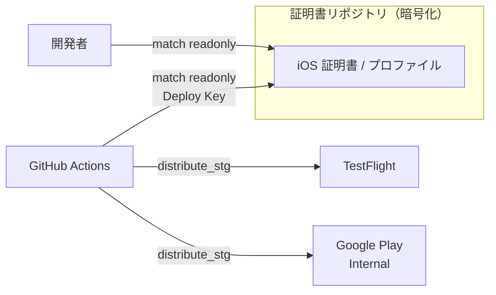

## TL;DR

- Flutter アプリの配信（iOS: TestFlight / Android: Google Play）を **Fastlane で自動化**した
- 証明書は **Fastlane match** で Git リポジトリに暗号化保管し、**チームと CI で共有**。ローカルに `.p12` を持たなくてよくなった
- 素直に組んだだけでは動かず、**`CocoaPods is broken` / TestFlight のジョブ 30 分拘束 / 32bit ネイティブライブラリ混入 / `Gemfile.lock` が Git 無視される** など、いくつも地雷を踏んだ
- この記事は「match でチーム配信を組む王道」ではなく、**その先で実際にハマった点と回避策**を中心に書く

## この記事の対象読者

- Flutter（または iOS/Android ネイティブ）アプリの**配信を自動化**したい方
- Fastlane match で**証明書をチーム管理**したいが、CI との組み合わせで詰まっている方
- 「チュートリアル通りやったのに動かない」の具体例を知りたい方

## 背景：手動配信と証明書の属人化がつらい

Flutter アプリを TestFlight や Google Play に手で上げるのは、地味に重労働です。ビルド番号を上げ、証明書を選び、IPA/AAB を作り、アップロードし、リリースノートを書く……。加えて **iOS の証明書・プロビジョニングプロファイルが特定の PC に紐づく**と、その人が休むと配信できない、という属人化も起きます。

これを **Fastlane** で自動化しました。配信先は次の通りです。

| プラットフォーム | 配信先 | トラック |
| --- | --- | --- |
| iOS | TestFlight | - |
| Android | Google Play Console | Internal Testing |

## 全体像：match で証明書を Git 管理し、CI から配信

Fastlane match は、iOS の配布証明書とプロビジョニングプロファイルを**暗号化して専用の Git リポジトリに保管**し、開発者と CI が同じものを取得できるようにする仕組みです。ローカルに `.p12` を配って回る必要がなくなります。



認証情報の持ち方はこう整理しました。

- **App Store Connect API Key（`.p8`）**: App Store Connect の Integrations で発行（match には Admin 権限が必要）
- **MATCH_PASSWORD**: match の暗号化パスフレーズ。macOS なら Keychain に入れ、shell rc から読み出すと OS レベルで保護できる
- **証明書リポジトリへのアクセス**: 開発者は組織メンバーシップ、CI は **Deploy Key**（GitHub Secret）で分離

## 実装のポイントと、踏んだ地雷

ここからが本題です。素直に組んで動かなかった点を順に紹介します。

### 地雷1: CI と手元で match の権限を分ける（readonly / 書き込み）

最初、CI でも書き込み可能な match を回していました。しかし CI が証明書を勝手に再発行してしまう事故が怖い。そこで **lane を役割で分けました**。

```ruby
# CI 用: 取得するだけ（readonly: true）
lane :sync_signing_appstore do
  setup_ci
  match(type: "appstore", app_identifier: ["jp.co.example.app", "jp.co.example.app.stg"],
        api_key: asc_api_key, readonly: true)
end

# ローカルのメンテ用: 新規発行・更新（書き込み発生）
lane :match_all do
  match(type: "appstore", app_identifier: [...], api_key: asc_api_key, readonly: false)
  match(type: "adhoc",    app_identifier: [...], api_key: asc_api_key, readonly: false)
end
```

- **CI は `readonly: true`**。リポジトリから証明書を取得するだけで、書き込みはしない
- **新しい bundle ID 追加・証明書の年次更新など、書き込みが要るメンテだけローカルで `match_all`**

「CI は消費者、発行は人間」と役割を切ったことで、証明書まわりの事故リスクが下がりました。

### 地雷2: `CocoaPods is broken` — Bundler の環境が subprocess を壊す

`bundle exec fastlane` 経由でビルドすると、iOS で突然こんなエラーが出ました。

```text
[!] CocoaPods is broken.
```

原因は Bundler でした。`bundle exec` 配下では Bundler が `GEM_HOME` を `vendor/bundle` に制限するため、**Flutter から呼ばれる `pod` が cocoapods gem を見つけられない**のです。

解決策は、ビルドを走らせる部分だけ **Bundler の環境変数を解除**すること。

```ruby
Bundler.with_unbundled_env do
  sh("cd .. && flutter build ipa --flavor stg ... " \
     "--export-options-plist=ios/ExportOptions-stg.plist")
end
```

`Bundler.with_unbundled_env` で囲むと、その中の subprocess はシステム Ruby 環境で `pod` を実行でき、エラーが消えました。Flutter × Fastlane × CocoaPods の組み合わせ特有の罠です。

### 地雷3: TestFlight で `changelog` を渡すとジョブが 30 分拘束される

iOS の TestFlight アップロードで、Apple のキューが混んでいるとジョブが延々と終わらない現象がありました。

犯人は `changelog` 引数でした。`upload_to_testflight` に `changelog` を渡すと、`skip_waiting_for_build_processing: true` を指定していても **「ビルドが build list に現れるまで待つ」挙動**になり、Apple 側の処理待ちでジョブが 30 分以上拘束されてしまいます。

```ruby
# 製品版アップロードでは changelog を渡さない
upload_to_testflight(
  api_key: asc_api_key,
  ipa: ipa_path,
  skip_waiting_for_build_processing: true,
  distribute_external: false
  # changelog: ... ← あえて渡さない。リリースノートは ASC 側で入力する
)
```

STG の内部配信では changelog を付けてすぐ配りたいので付ける、製品版アップロードでは付けない、と使い分けました。「オプション1つでジョブ時間が激変する」典型例です。

### 地雷4: バージョンは pubspec.yaml を SSOT にし、CI から上書き可能に

ビルド番号の管理をどこに置くか迷いましたが、**`pubspec.yaml` の `version`（例 `0.1.0+10`）を唯一の正**にしました。`0.1.0` が build-name、`10` が build-number です。

```ruby
def flutter_version
  pubspec = YAML.load_file("../pubspec.yaml")
  name, code = pubspec["version"].split("+")
  # CI からの上書きを許可: CI_BUILD_NUMBER があればそれを優先
  build_number = ENV["CI_BUILD_NUMBER"]&.to_i&.nonzero? || code.to_i
  { name: name, code: build_number }
end
```

普段は `pubspec.yaml` を編集するだけ。ただし CI では、ビルドごとにユニークな番号を振りたいので **`CI_BUILD_NUMBER` 環境変数があればそれを優先**する余地を残しました。

### 地雷5: 32bit ネイティブライブラリの混入を CI で弾く（ship-what-you-test）

これは一度やらかしかけた話です。ネイティブライブラリ（`.so`）を含むアプリで、ビルドキャッシュの取り違えにより **arm64 のスロットに 32bit の `.so` が混入した AAB** ができることがありました。そのまま製品版に載せると、64bit 端末でクラッシュしかねません。

そこで、アップロード前に **AAB を展開してアーキテクチャを検証**し、想定と違えば失敗させるガードを入れました。

```ruby
info = sh("unzip -p #{aab_path} base/lib/arm64-v8a/libpdfium.so > /tmp/lib.so && file /tmp/lib.so", log: false)
unless info.include?("ELF 64-bit") && info.include?("ARM aarch64")
  UI.user_error!("64bit ARM ではありません（アーキ不整合の恐れ）: #{info.strip}")
end
```

「テストしたものをそのまま出す（ship-what-you-test）」ため、Android では**同じ versionCode の AAB** をクローズドテストと製品版で使い回す運用にしています。だからこそ、載せる前の検証が効きます。

### 地雷6: `Gemfile.lock` が Git に追跡されない

Fastlane のバージョンを固定するには `Gemfile.lock` のコミットが必須です。ところが `.gitignore` に `*.lock` があると、`Gemfile.lock` まで無視されます。

```gitignore
# *.lock で無視される場合は、例外ルールで復活させる
!/Gemfile.lock
```

例外ルールを入れ、初回は `git add --force Gemfile.lock` で追加しました。地味ですが「CI と手元で Fastlane のバージョンがズレる」事故を防ぐ大事な一手です。

## 成果：配信がコマンド1つに

自動化の結果、配信はコマンド1つになりました。

```bash
# iOS + Android 両方に STG 配信
make distribute-stg
```

- **証明書の属人化が解消**（match で Git 管理、CI は Deploy Key で readonly 取得）
- **バージョン管理が pubspec.yaml に一本化**
- **リリースノートは直近コミットから自動生成**（`git log --no-merges` を整形）
- **不正な成果物（32bit 混入 AAB）は CI が自動で弾く**

## まとめ

- Fastlane match は「証明書のチーム共有」を綺麗に解決してくれる。**CI は readonly、発行は人間**の役割分担が安全
- ただしチュートリアル通りには動かない。**`CocoaPods is broken` は `Bundler.with_unbundled_env`**、**TestFlight の 30 分拘束は `changelog` を外す**、が実戦での回避策
- バージョンは **`pubspec.yaml` を SSOT**にしつつ CI 上書きの余地を残す
- **成果物の検証（アーキ混入チェック）を配信パイプラインに組み込む**と、事故を出荷前に止められる

Fastlane 自体の情報は多いですが、「Flutter × match × CI」を実運用に載せると、こうした細かな地雷が必ず出てきます。同じところで詰まっている方の時間短縮になれば幸いです。

## 参考リンク

- [fastlane 公式ドキュメント](https://docs.fastlane.tools/)
- [fastlane match（Codesigning concept）](https://docs.fastlane.tools/actions/match/)
- [upload_to_testflight](https://docs.fastlane.tools/actions/upload_to_testflight/)
- [upload_to_play_store（supply）](https://docs.fastlane.tools/actions/upload_to_play_store/)
