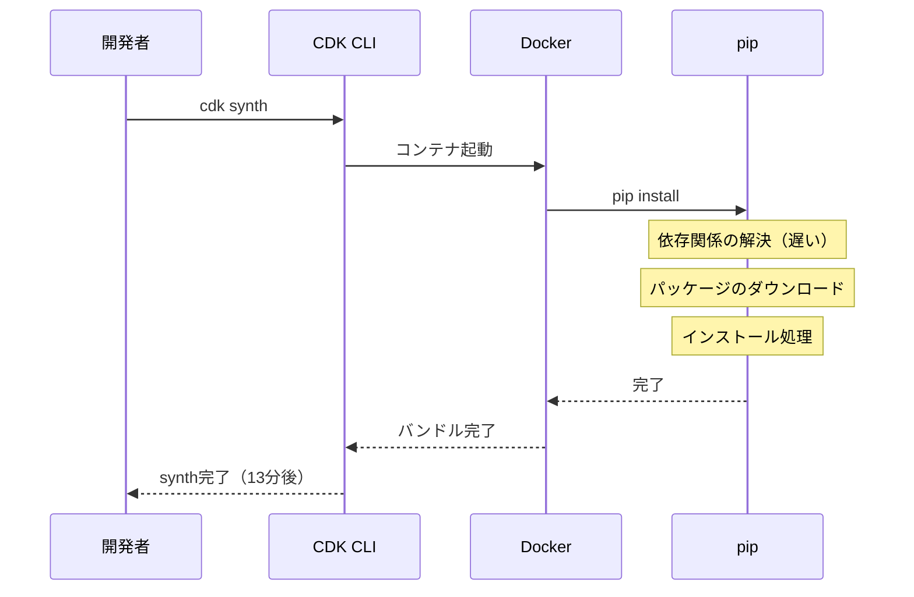
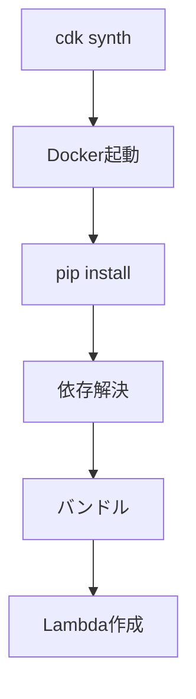
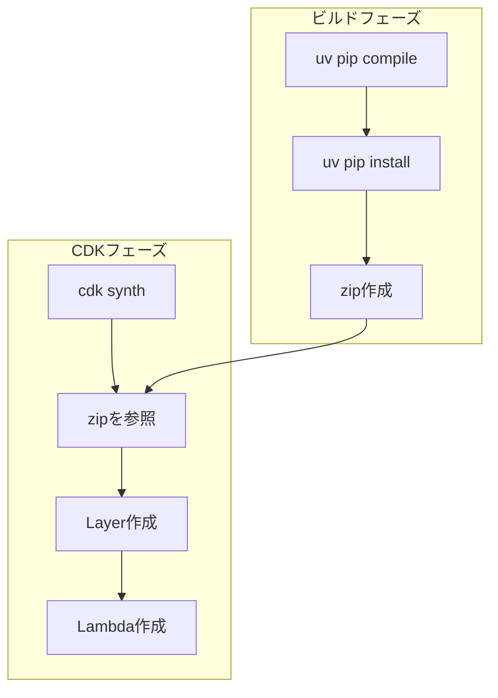

## TL;DR

- CDK `PythonFunction` から `Function + Layer` 構成に移行し、デプロイ時間を**14分→78秒**に短縮
- `uv` による依存関係のビルドで、従来の `pip` 比で大幅な高速化を実現
- CDK Synth単体では**13分→10秒**（約78倍高速化）

## この記事の対象読者

- AWS CDKでPython Lambdaを運用している方
- CI/CDパイプラインのビルド時間に悩んでいる方
- `uv` に興味があるが、実際の導入事例を知りたい方

## 背景：CDK PythonFunctionの限界

私たちのチームでは、AWS CDKを使ってPython製のLambda関数を管理していました。
当初は `aws-cdk-lib/aws-lambda-python-alpha` の `PythonFunction` を採用していました。
この構成は `pyproject.toml` から依存関係を自動でバンドルしてくれる便利さがある一方、開発が進むにつれて深刻なボトルネックが顕在化しました。

### 問題：cdk synthに13分かかる

```sh
$ cdk synth
# 13分後...
Successfully synthesized to cdk.out
```

なぜこんなに遅いのか。原因は `PythonFunction` の内部動作にありました。



**毎回のsynth/deployで発生する処理：**

1. Dockerコンテナの起動
2. コンテナ内で `pip install` を実行
3. 依存関係の解決とダウンロード
4. パッケージのインストールとバンドル

特に `pip` の依存関係解決は、パッケージ数が増えるほど指数関数的に遅くなります。私たちのプロジェクトでは20以上の依存パッケージがあり、これが致命的なボトルネックになっていました。

### 開発体験への影響

- **ローカル開発**: ちょっとした修正を試すのに13分待ち
- **CI/CD**: PRごとに14分のビルド時間
- **デプロイ頻度の低下**: 「まとめてデプロイしよう」という心理が働く

## 技術選定：なぜuvなのか

解決策を検討する中で、Rust製のPythonパッケージマネージャー **uv** に注目しました。

### uvとは

[uv](https://docs.astral.sh/uv/) は Astral社（Ruffの開発元）が開発したPythonパッケージマネージャーです。

**主な特徴：**

- Rust実装による圧倒的な速度
- `pip`, `pip-tools`, `virtualenv`, `poetry` の機能を統合
- `uv.lock` による完全な依存関係の固定

### uvを選んだ3つの理由

#### 1. 圧倒的な速度

公式ベンチマークでは `pip` の10〜100倍高速とされています。依存関係の解決アルゴリズムが最適化されており、並列ダウンロードも標準でサポートしています。

#### 2. 既存プロジェクトとの互換性

`pyproject.toml` をそのまま使えるため、移行コストが低いです。`uv sync` コマンドで既存の設定ファイルから環境を構築できます。

#### 3. CI/CDとの相性

キャッシュの仕組みが優れており、ロックファイル（`uv.lock`）をキーにしたキャッシュ戦略が取りやすいです。

## 実装：PythonFunctionからFunction + Layerへ

### 移行のアーキテクチャ

#### Before: PythonFunction



毎回のsynth/deployでDockerコンテナ起動→pip installが走り、依存関係の解決がボトルネックになっていました。

#### After: Function + Layer



事前にuvでビルドしたzipを参照するだけなので、CDK synthが高速化されました。

### ステップ1: uvのインストール

```bash
# macOS / Linux
curl -LsSf https://astral.sh/uv/install.sh | sh

# または Homebrew
brew install uv
```

### ステップ2: ビルドスクリプトの作成

```bash
#!/bin/bash
# scripts/build_lambda.sh

set -e

# dist/ディレクトリを作成
mkdir -p dist

# 依存関係をrequirements.txtにエクスポート
uv pip compile pyproject.toml -o dist/requirements.txt

# Layer用のディレクトリにインストール
uv pip install -r dist/requirements.txt --target dist/python

# zipファイルを作成
cd dist && zip -r ../lambda-layer.zip python
```

### ステップ3: CDKコードの変更

```python
# Before: PythonFunction
from aws_cdk.aws_lambda_python_alpha import PythonFunction

lambda_fn = PythonFunction(
    self,
    "MyFunction",
    entry="./functions",
    runtime=Runtime.PYTHON_3_12,
    index="handler.py",
    handler="handler",
)
```

```python
# After: Function + Layer
from aws_cdk import aws_lambda as _lambda

# 依存関係をLayerとして定義
dependencies_layer = _lambda.LayerVersion(
    self,
    "DependenciesLayer",
    code=_lambda.Code.from_asset("dist/lambda-layer.zip"),
    compatible_runtimes=[_lambda.Runtime.PYTHON_3_12],
    description="Python dependencies built with uv",
)

# Lambda関数
lambda_fn = _lambda.Function(
    self,
    "MyFunction",
    runtime=_lambda.Runtime.PYTHON_3_12,
    code=_lambda.Code.from_asset("./functions"),
    handler="handler.handler",
    layers=[dependencies_layer],
)
```

### ステップ4: CI/CDパイプラインの設定

Bitbucket Pipelinesでの設定例です。

```yaml
# bitbucket-pipelines.yml
image: python:3.12

definitions:
  caches:
    uv: ~/.cache/uv

steps:
  - step: &build-and-test
      name: Build and Test
      caches:
        - uv
      script:
        # uvのインストール
        - curl -LsSf https://astral.sh/uv/install.sh | sh
        - export PATH="$HOME/.local/bin:$PATH"

        # 依存関係のインストール（キャッシュ活用）
        - uv sync --frozen --all-extras

        # Lint & Format
        - uv run ruff check .
        - uv run ruff format --check .

        # 型チェック
        - uv run mypy functions/

        # テスト
        - uv run pytest --verbose --cov=functions

pipelines:
  pull-requests:
    '**':
      - step: *build-and-test
```

**ポイント：**

- `~/.cache/uv` をキャッシュすることで、2回目以降のビルドが高速化
- `uv sync --frozen` でロックファイルに完全に従った再現可能なビルド
- `uv run` で仮想環境内のコマンドを実行

## ハマったところと解決策

### 1. Lambda Layer のディレクトリ構造

Lambda Layerでは、Pythonパッケージは `python/` ディレクトリ配下に配置する必要があります。

```bash
# NG: パッケージ直置き
lambda-layer.zip
├── boto3/
└── requests/

# OK: python/ ディレクトリ配下
lambda-layer.zip
└── python/
    ├── boto3/
    └── requests/
```

`--target dist/python` と指定することで、正しい構造でインストールされます。

### 2. プラットフォーム依存のパッケージ

ローカル（macOS）でビルドしたパッケージがLambda（Linux）で動かないケースがあります。

```bash
# 解決策: Linuxプラットフォームを明示
uv pip install -r requirements.txt \
    --target dist/python \
    --platform linux \
    --python-version 3.12
```

### 3. uvのキャッシュが効かない

CI/CDでキャッシュが効いていないように見える場合、キャッシュキーの設定を確認してください。

```yaml
# Bitbucket Pipelines
caches:
  uv: ~/.cache/uv

# GitHub Actions
- uses: actions/cache@v4
  with:
    path: ~/.cache/uv
    key: uv-${{ runner.os }}-${{ hashFiles('uv.lock') }}
```

## 成果：デプロイ時間を10倍高速化

### Before / After 比較

| 項目 | Before (PythonFunction) | After (Function + Layer) | 改善率 |
| --- | --- | --- | --- |
| **CDK Synth** | 約13分 | 約10秒 | **約78倍高速化** |
| **総デプロイ時間** | 約14分 | 約78秒 | **約10倍高速化** |

### 副次的な効果

1. **再現性の向上**: `uv.lock` による完全な依存関係の固定
2. **CI/CDコストの削減**: ビルド時間短縮によるリソース節約
3. **開発体験の向上**: 即座にデプロイして確認できる

## まとめ

- CDK `PythonFunction` から `Function + Layer` への移行で、デプロイ時間を**14分→78秒**に短縮
- `uv` の高速な依存関係解決とキャッシュ機能がCI/CD改善の鍵
- 移行コストは低く、`pyproject.toml` をそのまま活用可能

`uv` は2024年にリリースされた比較的新しいツールですが、すでに多くのプロジェクトで採用が進んでいます。PythonのCI/CDパイプラインで時間がかかっている場合は、ぜひ導入を検討してみてください。

## 参考リンク

- [uv 公式ドキュメント](https://docs.astral.sh/uv/)
- [AWS CDK Python Lambda](https://docs.aws.amazon.com/cdk/api/v2/docs/aws-cdk-lib.aws_lambda-readme.html)
- [AWS Lambda Layers](https://docs.aws.amazon.com/lambda/latest/dg/chapter-layers.html)
