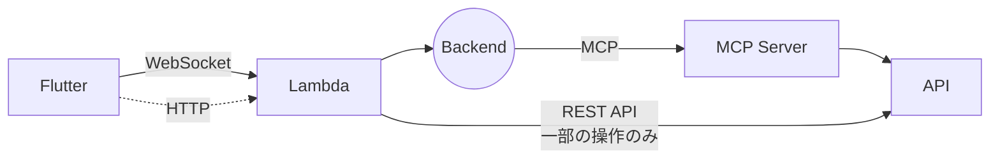
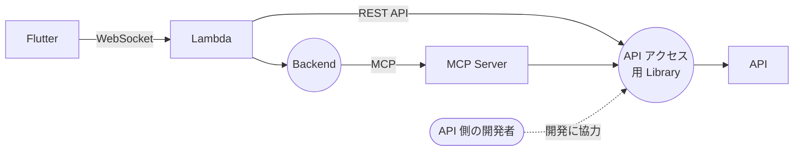
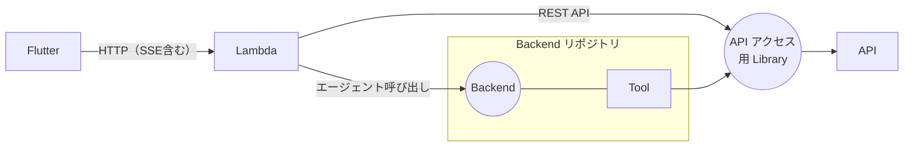
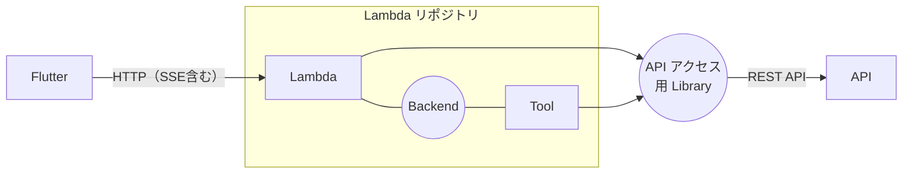

## TL;DR

- 生成AIアシスタントで **「画面表示のデータ取得まで MCP を経由して遅い」** という課題を抱えていた
- **本番稼働中**なので一気に作り替えられない。そこで **4 ステップの段階移行**を ADR（Architecture Decision Record）に整理して合意した
- 移行の骨子は **① API アクセス層の Library 化 → ② WebSocket を SSE 化 → ③ Backend と MCP を統合 → ④ 全部を 1 つの Lambda リポジトリへ統合**
- 最終形では経路が **Flutter ↔ Lambda ↔ Library ↔ API** だけになり、レイテンシと運用負荷を最小化する

## この記事の対象読者

- 生成AI/エージェントのシステムで**レイテンシや構成の複雑さ**に悩んでいる方
- **本番稼働中のシステムを、止めずに段階移行**する進め方を知りたい方
- ADR（設計判断の記録）を**チームの合意形成**にどう使うか興味がある方

## 前提：登場する 5 つの構成要素

題材にするのは、複数の業務系 SaaS をチャットで操作できるモバイルアプリの生成AIアシスタントです。「この申請を出しておいて」「先月の状況を見せて」と話しかけると、AI が適切な API を呼んで結果を返します。チャットとは別に、ホーム画面にはユーザーごとの状況を表示するカードも並んでいます。

この記事の図には 5 つの構成要素が出てきます。移行前の役割は次のとおりです。

| 構成要素           | 何をしているか                                                                                            | 実装                                                                                                                |
| -------------- | -------------------------------------------------------------------------------------------------- | ----------------------------------------------------------------------------------------------------------------- |
| **Flutter**    | モバイルアプリ本体。チャット画面とホーム画面のカードを表示する                                                                    | Flutter                                                                                                           |
| **Lambda**     | アプリの窓口となる API 層。ログインや SSO などの認証、連携先サービスのトークン管理、チャットの中継、一部の業務操作の REST API を担う                        | Python / AWS Lambda（API Gateway 経由）                                                                               |
| **Backend**    | AI エージェント本体。ユーザーの発話を LLM に渡し、どのツールを呼ぶかを判断し、結果をまとめて返答する                                             | Python / Strands Agents（AWS 製の OSS エージェントフレームワーク）/ Amazon Bedrock 上の Claude。Amazon Bedrock AgentCore Runtime 上で稼働 |
| **MCP Server** | エージェントが使う「ツール」の提供役。業務データの登録・一覧・照会などを MCP（Model Context Protocol）のツールとして公開し、呼ばれたら業務 API を叩く | Python / FastMCP。AgentCore Runtime 上で稼働                                                                           |
| **API**        | 連携先の既存業務サービスの REST API。アシスタントとは別の開発者が管理している                                                | 各サービスの開発者が管理                                                                                                      |

ポイントは、**Backend と MCP Server は「AI に判断させる処理」のための部品**だということです。Lambda は認証とアプリへの窓口、API は判断を伴わない普通のデータ源です。

## 背景：画面表示まで MCP を経由していて遅い

当初の構成はこうでした。

チャットで「申請を出して」と頼まれたとき、どのツールをどの引数で呼ぶかを LLM が決めるのは理にかなっています。MCP はそのための標準プロトコルです。

しかし移行前の構成では、**エージェント判断が不要な「ただの画面表示データ取得」まで Backend → MCP Server 経由**で API を叩いていました。ホーム画面のカードに状況を出すだけでも、Lambda → Backend（エージェント）→ MCP Server → API と 3 段を経由していたのです。Lambda から API を直接呼んでいたのは、一部の書き込み操作だけでした。ここに 2 つの問題がありました。

- **遅い**: Backend も MCP Server も AgentCore Runtime 上で動いており、**起動・呼び出しのオーバーヘッド**が大きい。画面表示のたびに MCP を挟むので体感が悪い
- **切れる**: Flutter ↔ Lambda が API Gateway の **WebSocket**。30 秒のアイドルタイムアウトがあり、エージェントの長考中に接続が切れる

かといって、**本番運用が始まっている以上、一気に大胆な変更はできません**。ユーザーへの影響を抑えながら、少しずつ確実に良くする必要がありました。

## なぜ ADR に残すのか

こういう「大きくて、順序が重要で、リスクを伴う」意思決定こそ、**ADR（Architecture Decision Record）**の出番です。今回は移行プランを ADR として書き、普段の開発サイクルの中で PR として出しました。PR レビューで議論し、承認されたマージをもって合意（Accepted）としています。会議を別に設けず、コードと同じ流れでレビューできるのも ADR の利点です。

ADR にする狙いは3つです。

- **順序と理由を明文化**する（なぜこの順番か、を後から追える）
- **各ステップのリスクを事前に洗い出す**（想定リスク / 検討事項を必ず併記）
- **関係者全員の合意の記録**にする（口頭合意で流れないように）

「動くコード」だけでなく「なぜそう決めたか」を残すのは、新しく加わるメンバーのオンボーディングにも効きます。

## 4 ステップの段階移行プラン

### Step1: API アクセスロジックを Library に切り出す

まず、**API アクセスロジックだけを共通 Library として切り出し**、REST API 経由のデータ取得を増やします。

- MCP Server と Lambda の**双方が同じ Library 経由**で API を叩く構成にする（Library は httpx と pydantic を使った Python パッケージで、Lambda の同期呼び出しと MCP Server の非同期呼び出しの両方に対応）
- エージェント判断が不要な画面表示は **Lambda → Library → API** の経路に寄せ、MCP を外す
- Lambda に直接実装していた既存の REST API も Library 経由に移植し、**API アクセスを一本化**

**期待効果**: 画面表示の応答改善（MCP を経由しない）、ロジック重複の解消、アシスタント側と API 側の責務境界の明確化。Library を別リポジトリにすることで、API 側の開発者も参加しやすくなります。

#### なぜ API を Library で「ラップ」するのか

Library は単なる HTTP クライアントの共通化ではありません。呼び出し先 API の**入口でのバリデーションが不十分**だったため、Library 側で検証してから API を呼ぶ形にしました。

ある書き込み系の API が分かりやすい例です。この API は、利用企業ごとに設定された業務ルールに反するリクエストでも、十分に弾きません。そこで Library に「ポリシー」を置き、API を呼ぶ前に次のような検証をしています。

- その操作が、そもそもアプリから実行できる設定になっているか
- 利用している端末の種類が許可されているか
- 入力された区分や自由記述の項目が、設定上許されているか

このチェックは、もともと Lambda と MCP Server の両方に別々に実装されていました。しかも実装が割れていて、Lambda には端末の許可チェックがあり、MCP Server には無いという差がありました。**同じ操作でも、チャット経由かボタン経由かで通る・通らないが変わりうる**状態です。Library ではより厳密な Lambda 側に合わせて一本化しました。

検証は通信を伴わない純粋関数として実装し、業務ルールの設定の取得やキャッシュは利用側の責務にしています。パッケージの配布基盤が無いため、配布は当面 Git のタグ指定による依存としました。バージョンは PR のラベルから semver を自動で決めてタグを打つ運用です。

Step1 を最初に置くのは、**後続の Step3・Step4 が前提とする「API アクセス層の共通化」を提供する土台**だからです。

### Step2: WebSocket を SSE に変える

次に、Flutter ↔ Lambda の通信を WebSocket から **HTTP（SSE 含む）** に切り替え、30 秒アイドル切断を解消します。

- SSE（Server-Sent Events）なら keep-alive コメントで接続を維持でき、**長時間のレスポンス生成に耐える**
- 双方向通信が不要な用途では SSE のほうがシンプルで運用コストが低い
- HTTP 系に統一することで、インフラ・認証・監視の経路が一本化される

この Step2 には別途「API Gateway で SSE が実用できるか」の技術調査を先行させました。結論だけ言うと **「API Gateway REST API は 2025-11 にレスポンスストリーミング対応となり致命的なブロッカーは無い。ただし本当の壁は Python Lambda がネイティブストリーミング非対応なこと」** でした。詳細は別記事に切り出しています（本記事末尾のリンク参照）。

### Step3: Backend と MCP を 1 つのリポジトリに統合する

MCP Server として外部化していた機能を、**Backend の Tool（関数呼び出し）として実装し直し**、同じリポジトリに統合します。

- Tool は Backend と同居し、**プロセス内で直接呼び出す**（MCP のプロトコル変換・プロセス越えを排除）
- API への経路は Step1 の Library に集約

**期待効果**: MCP プロトコル分のオーバーヘッドと実装コストの削減、Backend ↔ MCP 間のレイテンシ削減。

### Step4: Lambda / Backend / MCP を 1 つの Lambda リポジトリに統合する

最終的に、Lambda・Backend・（Tool 化した）MCP を **1 つの Lambda リポジトリに統合**します。

Lambda 関数の中で Backend（エージェント）を直接ホストする形です。経路が **Flutter ↔ Lambda ↔ Library ↔ API** だけになり、AgentCore Runtime への依存も解消。背景で挙げた起動・呼び出しオーバーヘッドの問題が根本から消えます。

## 移行順序の根拠

「なぜこの順番か」を ADR に明記しました。ここが段階移行の肝です。

- **Step1（Library 化）を最初に**: Step3・Step4 が前提とする「API アクセス層の共通化」を提供する土台だから
- **Step2（SSE 化）は独立タスク**: WebSocket 切断問題を解く。技術的には Step1 と並行可能だが、影響範囲を抑えるため Step1 完了後を推奨
- **Step3 は Step1 の Library がある前提**で実施
- **Step4 は最終形**なので最後

一気に Step4 の姿を目指さず、**各ステップ単独でも価値が出る（＝いつ中断しても改善が残る）順序**にしているのがポイントです。

## Consequences（この決定の帰結）

- 最終形の経路は **Flutter ↔ Lambda ↔ Library ↔ API のみ**になり、レイテンシが最小化される
- **AgentCore Runtime への依存が解消**される
- アシスタント側の開発は Lambda リポジトリ内に閉じたフローで進められる
- **API 側の開発者の貢献経路は Library に集約**し、Lambda リポジトリへの直接コミットは閉じる運用にする

各ステップには「想定リスク / 検討事項」も必ず添えました。たとえば Step1 では Library のバージョニング戦略（破壊的変更時の影響範囲）、Step3 では MCP を外部公開インタフェースとして使う他クライアントの有無、といった具合です。

## まとめ

- 生成AIシステムで**「エージェント判断が不要な処理まで MCP を経由して遅い」**なら、経路の見直しは効果が大きい
- 本番稼働中の移行は、**各ステップ単独で価値が出る順序**に分解する。いつ止めても改善が残る形にするのが安全
- 大きな移行こそ **ADR に「順序・理由・リスク」を明文化**して合意を取る。設計判断の記録は開発の資産になる
- 最終的に **AgentCore への依存を外し、Flutter ↔ Lambda ↔ Library ↔ API のシンプルな経路**に収束させる

「作り直したい」を「止めずに段階移行する」に変換する——その設計思考の一例として参考になれば幸いです。

## 関連記事

- **API GatewayでSSEはできる、本当の壁はLambdaがPythonだったこと - 生成AIチャットのWebSocket→SSE移行 技術調査**（本記事 Step2 の前提調査）

## 参考リンク

- [Architecture decision record（ADR） - GitHub adr/madr](https://adr.github.io/)
- [Model Context Protocol（MCP）公式](https://modelcontextprotocol.io/)
- [Amazon Bedrock AgentCore](https://docs.aws.amazon.com/bedrock-agentcore/)
