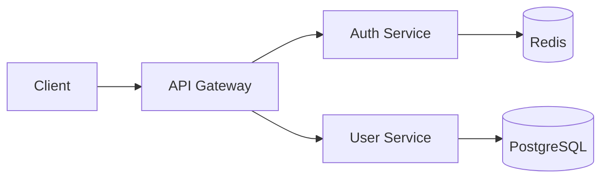

# テックブログ記述ルール

## 目的

- 採用候補者に技術力・チーム文化を伝える
- エンジニアの成長機会を創出する
- 技術コミュニティへの貢献

## 公開先

- [Zenn](https://zenn.dev/)

---

## 記事構成

### 基本方針：PREP法

**結論ファースト**で書く。忙しい読者でも価値がすぐわかる構成にする。

| 要素 | 内容 | 例 |
| ------ | ------ | ----- |
| **Point**（結論） | この記事で伝えたいこと・成果 | 「〇〇で処理速度を10倍改善した」 |
| **Reason**（理由） | なぜその結論に至ったか | 「ボトルネックは△△だった」 |
| **Example**（具体例） | 実装・コード・データ | コードサンプル、計測結果 |
| **Point**（結論） | 再度結論 + 学び・展望 | 「〇〇は有効。今後は□□も検討」 |

### 推奨構成例

```text
1. 結論（この記事でわかること・成果）
2. 背景・課題
3. 技術選定の理由
4. 実装のポイント
5. ハマったところと解決策
6. 成果・効果（数値があれば）
7. まとめ（結論の再掲 + 学び・今後の展望）
```

---

## 効果的なテクニック

### 1. 見出しだけで内容がわかる

見出しをスキャンするだけでストーリーが追える構成にする。目次で興味を引き、離脱を防ぐ。

```text
× 見出し例（悪い）
  - はじめに
  - 実装
  - まとめ

○ 見出し例（良い）
  - Redis導入でセッション管理を改善した
  - 既存のファイルベースセッションの問題点
  - Redisを選んだ3つの理由
  - 実装時にハマったTTL設定
  - レスポンス時間が50ms→5msに改善
```

### 2. 数字を入れる

定量化することで説得力が増す。曖昧な表現を避ける。

```text
× 「パフォーマンスが改善した」
○ 「レスポンス時間が200ms→50msに改善（75%削減）」

× 「大幅にコスト削減できた」
○ 「月額コストを$500→$150に削減（70%削減）」
```

### 3. Before/After を見せる

コード、アーキテクチャ図、パフォーマンス比較など。視覚的な差分は理解しやすい。

```text
## Before
- 処理時間: 10秒
- メモリ使用量: 2GB
- コード行数: 500行

## After
- 処理時間: 1秒（90%改善）
- メモリ使用量: 500MB（75%削減）
- コード行数: 200行（60%削減）
```

### 4. 読者のレベルを明示する

冒頭でターゲットを明確にし、ミスマッチを防ぐ。

```markdown
## この記事の対象読者

- Dockerの基本的な操作ができる方
- Kubernetesに興味があるが、まだ触ったことがない方
- マイクロサービスアーキテクチャの概念を理解している方
```

### 5. TL;DR（要約）を冒頭に置く

3〜5行で記事の要点をまとめる。PREP法の「結論」をさらに凝縮したもの。

```markdown
## TL;DR

- PostgreSQLのパーティショニングで検索速度を10倍改善
- 1億件のテーブルを月別に分割
- 実装コストは約2日、運用コストの増加はほぼなし
```

### 6. 図解・ダイアグラムを活用する

複雑な処理フローやアーキテクチャは図で説明する。ZennではMermaid記法が使える。

````markdown

````

### 7. 再現可能なコードを提供する

読者が手元で試せるコードを提供する。動作確認済みのコードは信頼性を高める。

**必須要素:**

- [ ] 動作確認済みのコードサンプル
- [ ] バージョン情報（言語、フレームワーク、ライブラリ）
- [ ] 環境構築手順またはリポジトリへのリンク
- [ ] 公式ドキュメントへの参照リンク

**コード取得時のポイント:**

- 公式ドキュメントや信頼できるソースからコードを参照する
- Context7などのツールを活用し、最新のAPIやベストプラクティスを確認する
- コピペだけでなく、必ず動作確認を行う

```markdown
## 環境

- Node.js: 20.x
- TypeScript: 5.3
- Next.js: 14.x

## リポジトリ

https://github.com/example/sample-project
```

---

## 記述スタイル

### 技術的な信頼性

- [ ] コードサンプルは動作確認済みのものを掲載
- [ ] バージョン情報を明記（言語、フレームワーク、ライブラリ）
- [ ] 参考にした公式ドキュメントや記事へのリンクを記載

### 読みやすさ

- [ ] 1文は60文字以内を目安に
- [ ] 専門用語には簡単な説明を添える
- [ ] 見出しを適切に使い、スキャンしやすくする
- [ ] コードブロックには言語指定をつける

### 採用視点で重要なポイント

- [ ] **Why（なぜ）を書く**: 技術選定や設計判断の理由
- [ ] **失敗談を恐れない**: 試行錯誤のプロセスは価値がある
- [ ] **チームの雰囲気が伝わる**: レビュー文化、議論の様子など
- [ ] **個人の学びを言語化**: 成長意欲が伝わる

---

## 避けるべきこと

- 機密情報・顧客情報の漏洩
- 他社・他者への批判
- 未検証の情報を断定的に書く
- コピペだけで検証していないコード

---

## 公開前チェックリスト

- [ ] タイトルは検索されやすいキーワードを含んでいるか
- [ ] 導入だけで記事の価値がわかるか
- [ ] コードは正しく動作するか
- [ ] 機密情報は含まれていないか
- [ ] 誤字脱字はないか
- [ ] OGP画像は設定したか（Zennの場合は自動生成）

---

## 参考：良いタイトルの例

```text
× 「DBの話」
○ 「PostgreSQLのパーティショニングで検索速度を10倍改善した話」

× 「CI/CDやってみた」
○ 「GitHub ActionsでRailsアプリのデプロイ時間を15分→3分に短縮した方法」
```
