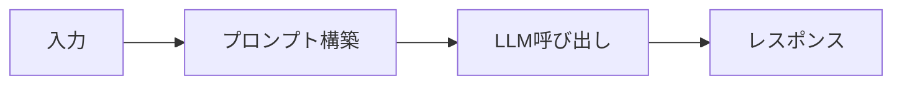
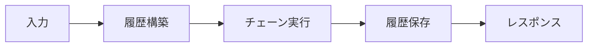
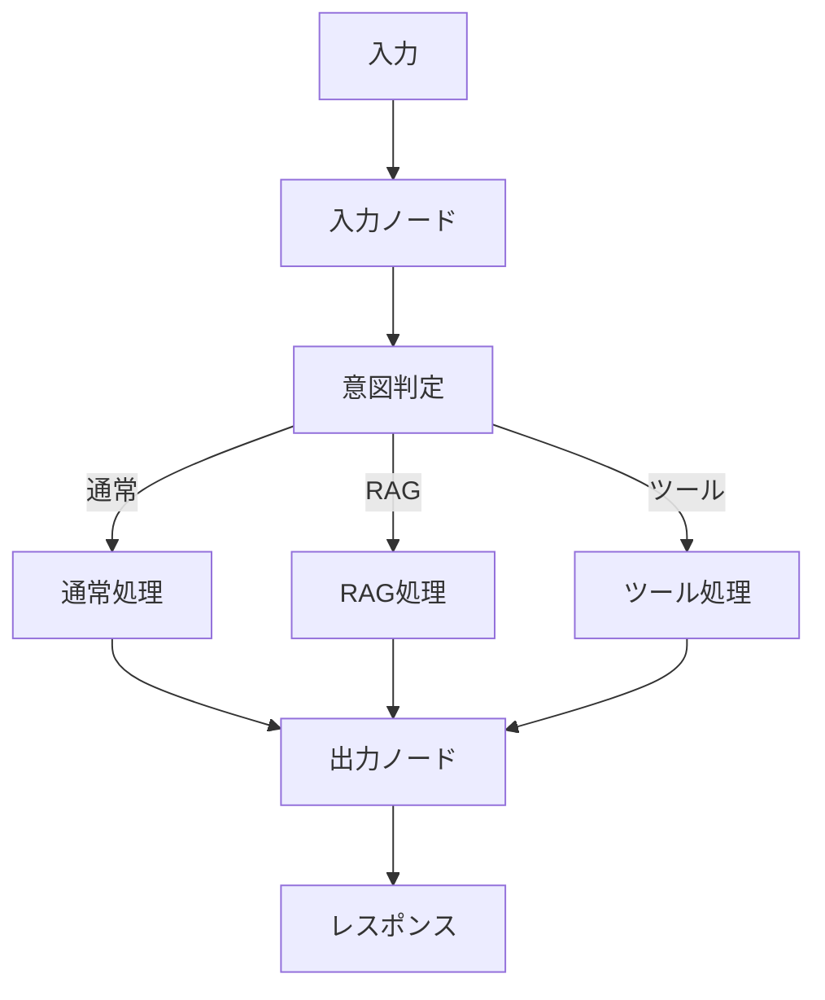

# LangChainとLangGraphを使い分ける - 3つのAIサービス実装の比較と選択ガイド

## はじめに

LLM（Large Language Model）を活用したアプリケーション開発において、どのような実装アプローチを選ぶべきか悩むことはありませんか？

本記事では、個人開発でLLMを活用したアプリケーションを開発する際に、**Clean Architecture**を採用し、インフラストラクチャ層のサービスを自由に選択できるように設計した経験から、同じ機能を実現するための3つの異なるアプローチ（GoogleAIService、LangChainAIService、LangGraphAIService）を実装し、比較しました。

それぞれの特徴と適切な選択方法について解説します。

### 対象読者

- LLMを活用したアプリケーション開発者
- LangChainやLangGraphを検討している方
- 複数の実装アプローチを比較したい方
- プロジェクトに適したAIサービス実装を選びたい方

### 前提条件

- Python 3.8以上
- LangChain、LangGraphの基本的な理解
- 非同期処理（async/await）の理解

### この記事でわかること

- 3つのAIサービス実装の違いと特徴
- プロンプト構築、会話履歴管理、実行フローの比較
- パフォーマンスと使用ケースの違い
- プロジェクトに適した実装の選択方法

## 3つのAIサービス実装とは？

Clean Architectureの設計により、インフラストラクチャ層のサービスを自由に選択できるようにしたため、以下の3つの異なるAIサービス実装を実装しました。

### 1. GoogleAIService

**特徴**:

- シンプルな実装
- LangChainの最小限の機能のみ使用
- 軽量で高速

**ファイル**: `ai_service.py`

### 2. LangChainAIService

**特徴**:

- LangChainの機能を活用
- プロンプトテンプレートとチェーンを使用
- 構造化された会話履歴管理

**ファイル**: `langchain_ai_service.py`

### 3. LangGraphAIService

**特徴**:

- LangGraphを使用した複雑なフロー制御
- 意図判定と条件分岐をサポート
- ステートマシンによる制御

**ファイル**: `langgraph_ai_service.py`

## 詳細比較

### プロンプト構築の違い

#### GoogleAIServiceのプロンプト構築

**方法**: 文字列連結による構築

```python
def _build_prompt(self, message: Message, context: str = "") -> str:
    # コンテキストがある場合は先頭に追加
    if context:
        return f"{context}\n\nUser: {message.content}\nAI:"
    return f"User: {message.content}\nAI:"
```

**特徴**:

- シンプルで直感的
- システムプロンプトなし
- 構造化されていない

#### LangChainAIServiceのプロンプト構築

**方法**: `ChatPromptTemplate`を使用

```python
from langchain.prompts import ChatPromptTemplate, MessagesPlaceholder

# プロンプトテンプレートの作成
self._prompt = ChatPromptTemplate.from_messages([
    ("system", settings.LANGCHAIN_SYSTEM_PROMPT),  # システムプロンプト
    MessagesPlaceholder(variable_name="history"),  # 会話履歴
    ("human", "{input}"),  # ユーザー入力
])
```

**特徴**:

- システムプロンプトを設定可能
- 会話履歴を構造化して管理
- テンプレートによる柔軟な構築

#### LangGraphAIServiceのプロンプト構築

**方法**: `ChatPromptTemplate`を使用（LangChainAIServiceと同様）

```python
self._prompt = ChatPromptTemplate.from_messages([
    ("system", settings.LANGCHAIN_SYSTEM_PROMPT),
    MessagesPlaceholder(variable_name="messages"),  # ステート内のメッセージ
])
```

**特徴**:

- LangChainAIServiceと同様のテンプレート機能
- ステート内のメッセージを活用
- ノードごとに異なるプロンプトを設定可能

### 会話履歴管理の違い

#### GoogleAIServiceの会話履歴管理

**方法**: 文字列としてプロンプトに埋め込み

```python
# 会話履歴を文字列として構築
history_string = "User: こんにちは\nAI: こんにちは！\nUser: 元気？\nAI: 元気です！"
prompt = f"{history_string}\n\nUser: {message.content}\nAI:"
```

**特徴**:

- シンプルな実装
- 構造化されていない
- メモリ管理なし

#### LangChainAIServiceの会話履歴管理

**方法**: `ChatMessageHistory`を使用

```python
from langchain.memory import ChatMessageHistory

# コンテキスト文字列から履歴を構築
messages = self._parse_context_to_messages(context)
history = ChatMessageHistory()
for msg in messages:
    history.add_message(msg)

# 会話後に履歴を更新
history.add_user_message(message.content)
history.add_ai_message(response.content)
```

**特徴**:

- コンテキスト文字列を解析してメッセージ履歴に変換
- 会話後に履歴を保存
- 構造化されたメッセージオブジェクト

#### LangGraphAIServiceの会話履歴管理

**方法**: ステート内の`messages`リストで管理

```python
from langgraph.graph import StateGraph

# ステートの定義
class GraphState(TypedDict):
    messages: list[BaseMessage]  # メッセージリスト

# ノード内でメッセージを追加
def normal_chat(state: GraphState):
    # ステート内のメッセージを使用
    messages = state["messages"]
    # 新しいメッセージを追加
    messages.append(HumanMessage(content=user_input))
    return {"messages": messages}
```

**特徴**:

- グラフのステートとして管理
- `add_messages`で自動的にメッセージを追加
- 各ノード間でステートを共有

### 実行フローの違い

#### GoogleAIServiceの実行フロー

**フロー**: シンプルな線形フロー



**実装例**:

```python
async def generate_response(
    self, 
    message: Message, 
    context: str = ""
) -> str:
    # 1. プロンプトを構築
    prompt = self._build_prompt(message, context)
    
    # 2. LLMを直接呼び出し
    messages = [HumanMessage(content=prompt)]
    response = await self._llm.ainvoke(messages)
    
    # 3. レスポンスを返す
    return response.content
```

#### LangChainAIServiceの実行フロー

**フロー**: チェーンベースの実行



**実装例**:

```python
async def generate_response(
    self, 
    message: Message, 
    context: str = ""
) -> str:
    # 1. コンテキストから履歴を構築
    messages = self._parse_context_to_messages(context)
    
    # 2. チェーンを作成（プロンプト | LLM）
    chain = self._prompt | self._llm
    
    # 3. チェーンを実行
    response = await chain.ainvoke({
        "input": message.content,
        "history": messages
    })
    
    # 4. 履歴を更新（メモリに保存）
    self._memory.chat_memory.add_user_message(message.content)
    self._memory.chat_memory.add_ai_message(response.content)
    
    return response.content
```

#### LangGraphAIServiceの実行フロー

**フロー**: グラフベースの実行（条件分岐あり）



**実装例**:

```python
async def generate_response(
    self, 
    message: Message, 
    context: str = ""
) -> str:
    # 1. ステートを初期化
    messages = self._parse_context_to_messages(context)
    messages.append(HumanMessage(content=message.content))
    
    state = {
        "messages": messages,
        "intent": None
    }
    
    # 2. グラフを実行（複数ノードを経由）
    final_state = None
    async for chunk in self._graph.astream(state):
        final_state = chunk
    
    # 3. レスポンスを取得
    last_message = final_state["messages"][-1]
    return last_message.content
```

### 設定の柔軟性

| 項目 | GoogleAIService | LangChainAIService | LangGraphAIService |
|------|----------------|-------------------|-------------------|
| **Temperature** | ハードコード（0.7） | 設定ファイルから取得 | 設定ファイルから取得 |
| **システムプロンプト** | なし | 設定ファイルから取得 | 設定ファイルから取得 |
| **メモリタイプ** | なし | 設定可能 | なし（ステートで管理） |
| **最大トークン数** | なし | 設定可能 | 設定可能 |
| **デバッグモード** | なし | なし | 設定可能 |

### ストリーミング処理の違い

#### GoogleAIServiceのストリーミング処理

```python
async def generate_stream(
    self, 
    message: Message, 
    context: str = ""
):
    prompt = self._build_prompt(message, context)
    messages = [HumanMessage(content=prompt)]
    
    # シンプルなストリーミング
    async for chunk in self._llm.astream(messages):
        if chunk.content:
            yield chunk.content
```

#### LangChainAIServiceのストリーミング処理

```python
async def generate_stream(
    self, 
    message: Message, 
    context: str = ""
):
    messages = self._parse_context_to_messages(context)
    chain = self._prompt | self._llm
    
    full_response = ""
    # チェーン経由のストリーミング
    async for chunk in chain.astream({
        "input": message.content, 
        "history": messages
    }):
        if hasattr(chunk, "content") and chunk.content:
            content = chunk.content
            full_response += content
            yield content
    
    # 完全なレスポンスを履歴に保存
    self._memory.chat_memory.add_ai_message(full_response)
```

#### LangGraphAIServiceのストリーミング処理

```python
async def generate_stream(
    self, 
    message: Message, 
    context: str = ""
):
    messages = self._parse_context_to_messages(context)
    messages.append(HumanMessage(content=message.content))
    state = {"messages": messages, "intent": None}
    
    # グラフの各ノードからのストリーミング
    async for chunk in self._graph.astream(state):
        for node_name, node_output in chunk.items():
            if node_name == "normal_chat" or node_name == "rag_chat":
                # ノードごとの出力を処理
                if "messages" in node_output:
                    last_message = node_output["messages"][-1]
                    if hasattr(last_message, "content"):
                        yield last_message.content
```

## パフォーマンス比較

| 項目 | GoogleAIService | LangChainAIService | LangGraphAIService |
|------|----------------|-------------------|-------------------|
| **初期化時間** | 最短 | 中程度 | 最長（グラフ構築） |
| **実行速度** | 最速 | 中程度 | やや遅い（ノード処理） |
| **メモリ使用量** | 最小 | 中程度 | やや多い（ステート管理） |
| **スケーラビリティ** | 低 | 中 | 高 |

## 使用ケースと選択ガイド

### GoogleAIServiceを選ぶ場合

**適しているケース**:

- ✅ シンプルな会話ボット
- ✅ プロトタイプ開発
- ✅ 最小限の依存関係で動作させたい場合
- ✅ システムプロンプトが不要
- ✅ 高速なレスポンスが最優先

**制限事項**:

- ❌ システムプロンプトなし
- ❌ 設定の柔軟性が低い
- ❌ メモリ管理なし
- ❌ 複雑なフロー制御が難しい

### LangChainAIServiceを選ぶ場合

**適しているケース**:

- ✅ 標準的な会話ボット
- ✅ システムプロンプトが必要
- ✅ 会話履歴の構造化管理が必要
- ✅ LangChainの機能を活用したい
- ✅ 設定の柔軟性が必要

**制限事項**:

- ❌ 条件分岐なし
- ❌ 複雑なフロー制御が難しい
- ❌ 意図判定とルーティングができない

### LangGraphAIServiceを選ぶ場合

**適しているケース**:

- ✅ 複雑な会話フローが必要
- ✅ 意図判定とルーティングが必要
- ✅ RAGやツール実行などの拡張機能を将来追加予定
- ✅ ステートマシンによる制御が必要
- ✅ 複数の処理パスを管理したい

**制限事項**:

- ❌ 実装が複雑
- ❌ パフォーマンスオーバーヘッドがある可能性
- ❌ 学習コストが高い

## 実際のコード例

### 基本的な使用例

#### GoogleAIServiceの使用例

```python
from app.infrastructure.services.ai_service import GoogleAIService
from app.domain.value_objects.message import Message
from datetime import datetime

# サービスの初期化
service = GoogleAIService()

# メッセージの作成
message = Message(
    content="こんにちは",
    timestamp=datetime.now(),
    sender="user"
)

# レスポンスの生成
response = await service.generate_response(message, context="")
print(response)  # "こんにちは！お元気ですか？"
```

#### LangChainAIServiceの使用例

```python
from app.infrastructure.services.langchain_ai_service import LangChainAIService
from app.domain.value_objects.message import Message
from datetime import datetime

# サービスの初期化
service = LangChainAIService()

# メッセージの作成
message = Message(
    content="こんにちは",
    timestamp=datetime.now(),
    sender="user"
)

# レスポンスの生成（会話履歴も管理される）
response = await service.generate_response(message, context="")
print(response)
```

#### LangGraphAIServiceの使用例

```python
from app.infrastructure.services.langgraph_ai_service import LangGraphAIService
from app.domain.value_objects.message import Message
from datetime import datetime

# サービスの初期化
service = LangGraphAIService()

# メッセージの作成
message = Message(
    content="こんにちは",
    timestamp=datetime.now(),
    sender="user",
    metadata={"session_id": "session_123"}  # セッション情報も設定可能
)

# レスポンスの生成（意図判定とルーティングが自動実行される）
response = await service.generate_response(message, context="")
print(response)
```

### ストリーミング例

#### GoogleAIServiceのストリーミング例

```python
# ストリーミングでレスポンスを取得
async for chunk in service.generate_stream(message, context=""):
    print(chunk, end="", flush=True)  # リアルタイムで出力
```

#### LangChainAIServiceのストリーミング例

```python
# ストリーミングでレスポンスを取得
async for chunk in service.generate_stream(message, context=""):
    print(chunk, end="", flush=True)
```

#### LangGraphAIServiceのストリーミング例

```python
# ストリーミングでレスポンスを取得
async for chunk in service.generate_stream(message, context=""):
    print(chunk, end="", flush=True)
```

## 注意点

### パフォーマンスに関する注意点

1. **初期化時間**: LangGraphAIServiceはグラフ構築に時間がかかるため、アプリケーション起動時に初期化することを推奨します
2. **メモリ使用量**: 会話履歴を保持するため、長時間実行する場合はメモリリークに注意が必要です
3. **スケーラビリティ**: 大量のリクエストを処理する場合は、適切なキャッシュ戦略を検討してください

### 実装に関する注意点

1. **エラーハンドリング**: 各サービスで適切なエラーハンドリングを実装してください
2. **ログ出力**: デバッグのために適切なログ出力を設定してください
3. **テスト**: 各サービスの動作を確認するためのテストを実装してください

## まとめ

3つのAIサービス実装は、それぞれ異なる用途に適しています：

- **GoogleAIService**: シンプルで軽量、プロトタイプ向け
- **LangChainAIService**: 標準的な会話ボット、LangChain機能活用
- **LangGraphAIService**: 複雑なフロー制御、拡張性重視

プロジェクトの要件に応じて適切なサービスを選択することで、効率的な開発が可能になります。

### 選択のポイント

1. **シンプルさを重視** → GoogleAIService
2. **標準的な機能が必要** → LangChainAIService
3. **複雑なフロー制御が必要** → LangGraphAIService

## 参考リンク

- [LangChain公式ドキュメント](https://python.langchain.com/)
- [LangGraph公式ドキュメント](https://langchain-ai.github.io/langgraph/)
- [Google AI Python SDK](https://github.com/google/generative-ai-python)
