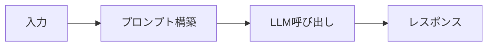
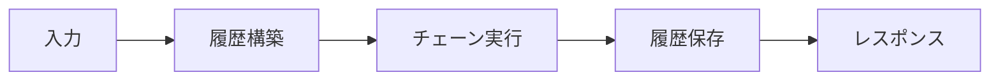
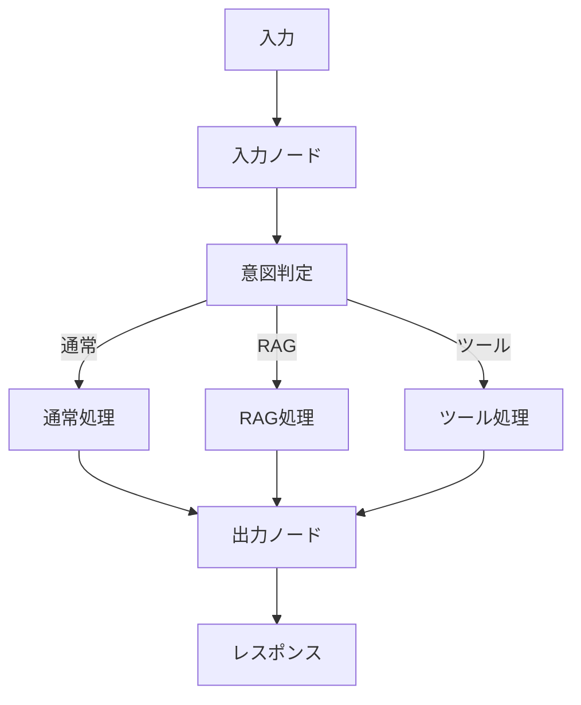

# LangChainとLangGraphを使い分ける - 3つのAIサービス実装の比較と選択ガイド

## はじめに

LLM（Large Language Model）を活用したアプリケーション開発において、どのような実装アプローチを選ぶべきか悩むことはありませんか？

本記事では、個人開発でLLMを活用したアプリケーションを開発する際に、**Clean Architecture**を採用し、インフラストラクチャ層のサービスを自由に選択できるように設計した経験から、同じ機能を実現するための3つの異なるアプローチ（GoogleAIService、LangChainAIService、LangGraphAIService）を実装し、比較しました。

それぞれの特徴と適切な選択方法について解説します。

### 対象読者

- LLMを活用したアプリケーション開発者
- LangChainやLangGraphを検討している方
- 複数の実装アプローチを比較したい方
- プロジェクトに適したAIサービス実装を選びたい方

### 前提条件

- Python 3.8以上
- LangChain、LangGraphの基本的な理解
- 非同期処理（async/await）の理解

### この記事でわかること

- 3つのAIサービス実装の違いと特徴
- プロンプト構築、会話履歴管理、実行フローの比較
- パフォーマンスと使用ケースの違い
- プロジェクトに適した実装の選択方法

## 3つのAIサービス実装とは？

Clean Architectureの設計により、インフラストラクチャ層のサービスを自由に選択できるようにしたため、以下の3つの異なるAIサービス実装を実現しました。

### 各サービスの概要比較

| 項目 | GoogleAIService | LangChainAIService | LangGraphAIService |
|------|----------------|-------------------|-------------------|
| **複雑さ** | 低（シンプル） | 中（標準的） | 高（複雑） |
| **パフォーマンス** | 最速 | 中程度 | やや遅い |
| **柔軟性** | 低 | 高 | 最高 |
| **初期化時間** | 最短 | 中程度 | 最長 |
| **メモリ使用量** | 最小 | 中程度 | やや多い |
| **拡張性** | 低 | 中 | 高 |
| **学習コスト** | 低 | 中 | 高 |

### 1. GoogleAIService

**ファイル**: `ai_service.py`

**主な特徴**:

- **シンプルな実装**: 最小限のコードで実装可能
- **高速なパフォーマンス**: オーバーヘッドが少なく、最速のレスポンスタイム
- **軽量**: LangChainの最小限の機能のみ使用
- **低い学習コスト**: すぐに理解できるシンプルな構造

**差別化要因**:

- ✅ **パフォーマンス重視**: 高速なレスポンスが必要な場合に最適
- ✅ **シンプルさ**: プロトタイプや小規模なプロジェクトに適している
- ✅ **依存関係の最小化**: 外部ライブラリへの依存を最小限に抑えたい場合

**制限事項**:

- ❌ システムプロンプトの設定ができない
- ❌ 会話履歴の構造化管理ができない
- ❌ 複雑なフロー制御が難しい

### 2. LangChainAIService

**ファイル**: `langchain_ai_service.py`

**主な特徴**:

- **標準的な実装**: LangChainの標準的な機能を活用
- **柔軟な設定**: システムプロンプト、Temperature、メモリタイプなどを設定可能
- **構造化された管理**: 会話履歴を構造化して管理
- **バランスの取れた設計**: 機能性とパフォーマンスのバランスが良い

**差別化要因**:

- ✅ **柔軟性**: 設定ファイルから様々なパラメータを調整可能
- ✅ **標準的な機能**: 多くのユースケースに対応できる標準的な実装
- ✅ **構造化された管理**: 会話履歴を構造化して管理できる
- ✅ **適度な複雑さ**: 学習コストと機能性のバランスが良い

**制限事項**:

- ❌ 条件分岐やルーティングができない
- ❌ 複雑なフロー制御が難しい

### 3. LangGraphAIService

**ファイル**: `langgraph_ai_service.py`

**主な特徴**:

- **複雑なフロー制御**: グラフベースの実行により、複雑な処理フローを実現
- **意図判定とルーティング**: ユーザーの意図に応じて処理を分岐
- **ステートマシン**: ステートマシンによる制御で、複数のノードを経由した処理が可能
- **高い拡張性**: RAGやツール実行などの拡張機能を追加しやすい

**差別化要因**:

- ✅ **拡張性**: 将来的にRAGやツール実行などの機能を追加しやすい
- ✅ **複雑なフロー制御**: 意図判定や条件分岐による柔軟な処理が可能
- ✅ **ステート管理**: グラフのステートとして、複数のノード間で情報を共有
- ✅ **将来性**: 複雑な機能を追加する予定がある場合に最適

**制限事項**:

- ❌ 実装が複雑で学習コストが高い
- ❌ パフォーマンスオーバーヘッドがある可能性
- ❌ 初期化に時間がかかる

### 選択の指針

各サービスを選択する際の指針は以下の通りです：

- **GoogleAIService**: シンプルさとパフォーマンスを重視する場合
- **LangChainAIService**: 標準的な機能と柔軟性を重視する場合
- **LangGraphAIService**: 複雑なフロー制御と拡張性を重視する場合

詳細な比較については、以下のセクションで詳しく解説します。

## 詳細比較

### プロンプト構築の違いと実装上の注意点

プロンプト構築は、LLMの応答品質に直接影響する重要な要素です。各サービスで異なるアプローチを採用している理由と、実装時の注意点を解説します。

#### GoogleAIServiceのプロンプト構築

**実装方法**: 文字列連結による構築

```python
def _build_prompt(self, message: Message, context: str = "") -> str:
    # コンテキストがある場合は先頭に追加
    if context:
        return f"{context}\n\nUser: {message.content}\nAI:"
    return f"User: {message.content}\nAI:"
```

**なぜこの方法を選んだか**:

- **シンプルさ**: 最小限の依存関係で実装可能
- **パフォーマンス**: 文字列操作のみで高速
- **デバッグの容易さ**: プロンプト全体を一目で確認できる

**実装上の注意点**:

⚠️ **トークン数の管理が必要**: 会話履歴が長くなると、LLMの最大トークン数を超える可能性があります。以下のような対策を検討してください：

```python
def _build_prompt(self, message: Message, context: str = "") -> str:
    # 会話履歴が長すぎる場合は切り詰める
    if context:
        # 簡易的な実装例：最後のN行のみを使用
        lines = context.split('\n')
        if len(lines) > 20:  # 例：20行を超える場合
            context = '\n'.join(lines[-20:])
        return f"{context}\n\nUser: {message.content}\nAI:"
    return f"User: {message.content}\nAI:"
```

⚠️ **特殊文字のエスケープ**: ユーザー入力に改行や特殊文字が含まれる場合、意図しない動作を引き起こす可能性があります。

⚠️ **システムプロンプトの欠如**: アプリケーションの動作を制御するシステムプロンプトが設定できないため、応答の一貫性を保つのが難しい場合があります。

#### LangChainAIServiceのプロンプト構築

**実装方法**: `ChatPromptTemplate`を使用

```python
from langchain.prompts import ChatPromptTemplate, MessagesPlaceholder

# プロンプトテンプレートの作成
self._prompt = ChatPromptTemplate.from_messages([
    ("system", settings.LANGCHAIN_SYSTEM_PROMPT),  # システムプロンプト
    MessagesPlaceholder(variable_name="history"),  # 会話履歴
    ("human", "{input}"),  # ユーザー入力
])
```

**なぜこの方法を選んだか**:

- **構造化**: メッセージタイプ（system, human, ai）を明確に区別
- **柔軟性**: 設定ファイルからシステムプロンプトを変更可能
- **拡張性**: 将来的にメッセージタイプを追加しやすい

**実装上の注意点**:

✅ **システムプロンプトの重要性**: システムプロンプトは、LLMの応答スタイルや動作を制御する上で非常に重要です。適切に設定することで、一貫性のある応答を得られます。

```python
# 設定ファイル例（.env）
LANGCHAIN_SYSTEM_PROMPT="あなたは親切なアシスタントです。ユーザーの質問に対して、簡潔で分かりやすい回答を心がけてください。"
```

⚠️ **MessagesPlaceholderの変数名**: `variable_name`は、チェーン実行時に渡す辞書のキーと一致させる必要があります。不一致があるとエラーになります。

```python
# 正しい使用例
response = await chain.ainvoke({
    "input": message.content,
    "history": messages  # MessagesPlaceholderのvariable_name="history"と一致
})
```

⚠️ **プロンプトテンプレートの初期化タイミング**: プロンプトテンプレートは、サービスの初期化時に一度だけ作成することを推奨します。毎回作成するとパフォーマンスが低下します。

#### LangGraphAIServiceのプロンプト構築

**実装方法**: `ChatPromptTemplate`を使用（LangChainAIServiceと同様）

```python
self._prompt = ChatPromptTemplate.from_messages([
    ("system", settings.LANGCHAIN_SYSTEM_PROMPT),
    MessagesPlaceholder(variable_name="messages"),  # ステート内のメッセージ
])
```

**なぜこの方法を選んだか**:

- **ノード間の一貫性**: 各ノードで同じプロンプトテンプレートを使用可能
- **ステートとの統合**: グラフのステート内のメッセージを直接活用
- **柔軟な拡張**: ノードごとに異なるプロンプトを設定することも可能

**実装上の注意点**:

✅ **ノードごとのプロンプトカスタマイズ**: 複雑なフローでは、ノードごとに異なるプロンプトを設定することで、より細かい制御が可能です：

```python
# 通常チャット用のプロンプト
normal_prompt = ChatPromptTemplate.from_messages([
    ("system", "あなたは親切なアシスタントです。"),
    MessagesPlaceholder(variable_name="messages"),
])

# RAG用のプロンプト
rag_prompt = ChatPromptTemplate.from_messages([
    ("system", "あなたは検索結果を基に回答するアシスタントです。"),
    MessagesPlaceholder(variable_name="messages"),
    ("human", "検索結果: {context}\n\n質問: {input}"),
])
```

⚠️ **ステートのメッセージ形式**: ステート内の`messages`は`BaseMessage`オブジェクトのリストである必要があります。文字列を直接渡すとエラーになります。

⚠️ **プロンプトの評価タイミング**: LangGraphでは、各ノードでプロンプトが評価されます。ステートが更新されるたびに再評価されるため、パフォーマンスに注意が必要です。

### 会話履歴管理の違いと実装上の落とし穴

会話履歴の管理方法は、アプリケーションのパフォーマンスやメモリ使用量に大きく影響します。各サービスで採用している方法の理由と、実装時に注意すべき点を解説します。

#### GoogleAIServiceの会話履歴管理

**実装方法**: 文字列としてプロンプトに埋め込み

```python
# 会話履歴を文字列として構築
history_string = "User: こんにちは\nAI: こんにちは！\nUser: 元気？\nAI: 元気です！"
prompt = f"{history_string}\n\nUser: {message.content}\nAI:"
```

**なぜこの方法を選んだか**:

- **シンプルさ**: 追加のライブラリやデータ構造が不要
- **パフォーマンス**: 文字列操作のみで高速
- **デバッグの容易さ**: プロンプト全体を文字列として確認できる

**実装上の落とし穴**:

⚠️ **トークン数の爆発的増加**: 会話が長くなるにつれて、プロンプト全体のトークン数が指数関数的に増加します。LLMの最大トークン数（例：32,000トークン）を超えるとエラーになります。

```python
# 問題のある実装例
def _build_prompt(self, message: Message, context: str = "") -> str:
    # 会話が長い場合、トークン数が上限を超える可能性
    if context:
        return f"{context}\n\nUser: {message.content}\nAI:"
    return f"User: {message.content}\nAI:"
```

**対策**: 会話履歴の長さを制限する必要があります：

```python
def _truncate_history(self, context: str, max_lines: int = 10) -> str:
    """会話履歴を指定行数に切り詰める"""
    lines = context.split('\n')
    if len(lines) > max_lines:
        # 最新のN行のみを保持
        return '\n'.join(lines[-max_lines:])
    return context
```

⚠️ **メモリリークのリスク**: 会話履歴を文字列として保持し続けると、メモリ使用量が増加します。長時間実行するアプリケーションでは、定期的に履歴をクリアする仕組みが必要です。

⚠️ **構造化されていない**: メッセージのタイプ（ユーザー/AI）を区別するのが難しく、後から履歴を解析する際に問題が発生する可能性があります。

#### LangChainAIServiceの会話履歴管理

**実装方法**: `ChatMessageHistory`を使用

```python
from langchain.memory import ChatMessageHistory
from langchain.schema import HumanMessage, AIMessage

# コンテキスト文字列から履歴を構築
messages = self._parse_context_to_messages(context)
history = ChatMessageHistory()
for msg in messages:
    history.add_message(msg)

# 会話後に履歴を更新
history.add_user_message(message.content)
history.add_ai_message(response.content)
```

**なぜこの方法を選んだか**:

- **構造化**: メッセージタイプを明確に区別できる
- **型安全性**: `BaseMessage`オブジェクトにより、型チェックが可能
- **拡張性**: 将来的にメタデータを追加しやすい

**実装上の落とし穴**:

✅ **コンテキスト文字列の解析**: 外部から受け取ったコンテキスト文字列を、構造化されたメッセージに変換する必要があります。この変換処理が正しく実装されていないと、会話履歴が失われる可能性があります。

```python
def _parse_context_to_messages(self, context: str) -> list[BaseMessage]:
    """コンテキスト文字列をメッセージリストに変換"""
    messages = []
    lines = context.split('\n')
    
    for line in lines:
        if line.startswith('User: '):
            messages.append(HumanMessage(content=line[6:]))  # "User: "を除去
        elif line.startswith('AI: '):
            messages.append(AIMessage(content=line[4:]))  # "AI: "を除去
    
    return messages
```

⚠️ **メモリの永続化**: `ChatMessageHistory`はデフォルトではメモリ内にのみ保持されます。アプリケーションを再起動すると履歴が失われます。永続化が必要な場合は、データベースやファイルシステムに保存する必要があります。

⚠️ **メモリ使用量**: 構造化されたメッセージオブジェクトは、文字列よりも多くのメモリを使用します。大量の会話履歴を保持する場合は、メモリ使用量に注意が必要です。

✅ **メモリタイプの選択**: LangChainでは、様々なメモリタイプ（`ConversationBufferMemory`、`ConversationSummaryMemory`など）を選択できます。用途に応じて適切なタイプを選ぶことが重要です：

```python
from langchain.memory import ConversationSummaryMemory

# 会話履歴を要約して保持するメモリ
memory = ConversationSummaryMemory(
    llm=self._llm,
    return_messages=True
)
```

#### LangGraphAIServiceの会話履歴管理

**実装方法**: ステート内の`messages`リストで管理

```python
from langgraph.graph import StateGraph
from typing import TypedDict
from langchain.schema import BaseMessage

# ステートの定義
class GraphState(TypedDict):
    messages: list[BaseMessage]  # メッセージリスト

# ノード内でメッセージを追加
def normal_chat(state: GraphState):
    # ステート内のメッセージを使用
    messages = state["messages"]
    # 新しいメッセージを追加
    messages.append(HumanMessage(content=user_input))
    return {"messages": messages}
```

**なぜこの方法を選んだか**:

- **ノード間の共有**: グラフの各ノードで同じステートを共有できる
- **不変性の管理**: LangGraphが自動的にステートの不変性を管理
- **デバッグの容易さ**: ステート全体を確認することで、処理の流れを追跡できる

**実装上の落とし穴**:

⚠️ **ステートの不変性**: LangGraphでは、ステートは不変（immutable）として扱われます。ノード内でステートを直接変更すると、予期しない動作を引き起こす可能性があります。

```python
# 間違った実装例
def normal_chat(state: GraphState):
    messages = state["messages"]
    messages.append(HumanMessage(content=user_input))  # 直接変更（非推奨）
    return {"messages": messages}
```

**正しい実装**:

```python
# 正しい実装例
def normal_chat(state: GraphState):
    messages = state["messages"]
    # 新しいリストを作成して返す
    new_messages = messages + [HumanMessage(content=user_input)]
    return {"messages": new_messages}
```

⚠️ **メッセージの順序**: ステート内のメッセージの順序は重要です。順序が正しくないと、LLMが会話の文脈を正しく理解できません。

⚠️ **ステートのサイズ**: グラフのステートが大きくなると、各ノード間での受け渡しに時間がかかります。必要に応じて、ステートのサイズを最適化する必要があります。

✅ **ステートの検証**: LangGraphでは、ステートの型定義（`TypedDict`）により、型チェックが可能です。これにより、実行時エラーを防ぐことができます。

### 実行フローの違い

#### GoogleAIServiceの実行フロー

**フロー**: シンプルな線形フロー



**このフローが選ばれる状況**:

- ✅ **高速なレスポンスが必要**: リアルタイム性が重視されるアプリケーション
- ✅ **シンプルな会話ボット**: 複雑な処理が不要な基本的なチャット機能
- ✅ **プロトタイプ開発**: 迅速に動作確認したい場合
- ✅ **リソース制約がある環境**: メモリやCPUリソースが限られている場合

**各ステップの処理時間目安**:

| ステップ | 処理内容 | 処理時間目安 | 備考 |
|---------|---------|------------|------|
| **プロンプト構築** | 文字列連結 | 0.1-1ms | 会話履歴の長さに依存 |
| **LLM呼び出し** | APIリクエスト | 500-2000ms | LLMの応答時間が大部分を占める |
| **レスポンス返却** | 文字列返却 | 0.1ms以下 | ほぼ無視できる |

**総処理時間**: 約500-2000ms（LLMの応答時間が支配的）

**パフォーマンス特性**:

- **オーバーヘッドが最小**: 追加の処理がほとんどないため、LLMの応答時間がそのまま全体の処理時間になる
- **スケーラビリティ**: シンプルな構造のため、並列処理が容易
- **メモリ効率**: 最小限のメモリ使用量

**実装例**:

```python
async def generate_response(
    self, 
    message: Message, 
    context: str = ""
) -> str:
    # 1. プロンプトを構築
    prompt = self._build_prompt(message, context)
    
    # 2. LLMを直接呼び出し
    messages = [HumanMessage(content=prompt)]
    response = await self._llm.ainvoke(messages)
    
    # 3. レスポンスを返す
    return response.content
```

#### LangChainAIServiceの実行フロー

**フロー**: チェーンベースの実行



**このフローが選ばれる状況**:

- ✅ **標準的な会話ボット**: システムプロンプトや会話履歴管理が必要な場合
- ✅ **設定の柔軟性が必要**: 環境変数や設定ファイルから動作を変更したい場合
- ✅ **会話履歴の構造化管理**: メッセージタイプを明確に区別したい場合
- ✅ **バランスの取れた実装**: 機能性とパフォーマンスのバランスを重視する場合

**各ステップの処理時間目安**:

| ステップ | 処理内容 | 処理時間目安 | 備考 |
|---------|---------|------------|------|
| **履歴構築** | コンテキスト文字列の解析 | 1-10ms | 履歴の長さに依存 |
| **チェーン実行** | プロンプト評価 + LLM呼び出し | 500-2000ms | LLMの応答時間が大部分 |
| **履歴保存** | メモリへの保存 | 0.5-2ms | メモリタイプに依存 |
| **レスポンス返却** | 文字列返却 | 0.1ms以下 | ほぼ無視できる |

**総処理時間**: 約500-2010ms（LLMの応答時間が支配的だが、履歴処理のオーバーヘッドあり）

**パフォーマンス特性**:

- **適度なオーバーヘッド**: 履歴構築と保存により、GoogleAIServiceより若干遅い
- **構造化の利点**: メッセージの型安全性により、デバッグが容易
- **メモリ管理**: 構造化されたメッセージオブジェクトにより、メモリ使用量が増加

**実装上の注意点**:

⚠️ **履歴構築の最適化**: コンテキスト文字列の解析処理は、会話履歴が長くなると処理時間が増加します。必要に応じてキャッシュを検討してください。

⚠️ **チェーンの再利用**: チェーンは毎回作成するのではなく、サービスの初期化時に作成して再利用することで、パフォーマンスを向上できます。

**実装例**:

```python
async def generate_response(
    self, 
    message: Message, 
    context: str = ""
) -> str:
    # 1. コンテキストから履歴を構築
    messages = self._parse_context_to_messages(context)
    
    # 2. チェーンを作成（プロンプト | LLM）
    chain = self._prompt | self._llm
    
    # 3. チェーンを実行
    response = await chain.ainvoke({
        "input": message.content,
        "history": messages
    })
    
    # 4. 履歴を更新（メモリに保存）
    self._memory.chat_memory.add_user_message(message.content)
    self._memory.chat_memory.add_ai_message(response.content)
    
    return response.content
```

#### LangGraphAIServiceの実行フロー

**フロー**: グラフベースの実行（条件分岐あり）



**このフローが選ばれる状況**:

- ✅ **複雑な会話フロー**: ユーザーの意図に応じて処理を分岐する必要がある場合
- ✅ **RAG機能の実装**: 検索結果を基に回答を生成する場合
- ✅ **ツール実行機能**: 外部APIやデータベースへのアクセスが必要な場合
- ✅ **将来の拡張性**: 複雑な機能を追加する予定がある場合

**各ステップの処理時間目安**:

| ステップ | 処理内容 | 処理時間目安 | 備考 |
|---------|---------|------------|------|
| **入力ノード** | ステートの初期化 | 1-5ms | メッセージ数の増加に伴い増加 |
| **意図判定** | LLMによる意図分類 | 200-800ms | 軽量なLLM呼び出し |
| **通常処理** | 標準的なLLM呼び出し | 500-2000ms | 意図判定後の処理 |
| **RAG処理** | 検索 + LLM呼び出し | 1000-3000ms | 検索処理が追加される |
| **ツール処理** | ツール実行 + LLM呼び出し | 1000-5000ms | ツールの実行時間に依存 |
| **出力ノード** | レスポンスの整形 | 0.5-2ms | ほぼ無視できる |

**総処理時間**:

- **通常処理**: 約700-2800ms
- **RAG処理**: 約1200-3800ms
- **ツール処理**: 約1200-5800ms（ツールの実行時間に大きく依存）

**パフォーマンス特性**:

- **オーバーヘッドが大きい**: グラフの実行により、他のサービスより処理時間が長い
- **柔軟性の代償**: 複雑なフロー制御のため、パフォーマンスが犠牲になる
- **スケーラビリティ**: 各ノードを独立して最適化できるため、将来的な拡張が容易

**実装上の注意点**:

⚠️ **意図判定の最適化**: 意図判定は毎回実行されるため、軽量なLLMモデルを使用するか、キャッシュを検討してください。

⚠️ **ノード間のデータ受け渡し**: ステートのサイズが大きくなると、ノード間の受け渡しに時間がかかります。必要最小限のデータのみをステートに保持することを推奨します。

⚠️ **並列処理の可能性**: RAG処理やツール処理は、並列実行できる場合があります。LangGraphの並列処理機能を活用することで、パフォーマンスを向上できます。

✅ **デバッグモードの活用**: `LANGGRAPH_DEBUG=True`に設定することで、各ノードの実行状況を確認できます。パフォーマンスのボトルネックを特定する際に有用です。

**実装例**:

```python
async def generate_response(
    self, 
    message: Message, 
    context: str = ""
) -> str:
    # 1. ステートを初期化
    messages = self._parse_context_to_messages(context)
    messages.append(HumanMessage(content=message.content))
    
    state = {
        "messages": messages,
        "intent": None
    }
    
    # 2. グラフを実行（複数ノードを経由）
    final_state = None
    async for chunk in self._graph.astream(state):
        final_state = chunk
    
    # 3. レスポンスを取得
    last_message = final_state["messages"][-1]
    return last_message.content
```

### 設定の柔軟性

| 項目 | GoogleAIService | LangChainAIService | LangGraphAIService |
|------|----------------|-------------------|-------------------|
| **Temperature** | ハードコード（0.7） | 設定ファイルから取得 | 設定ファイルから取得 |
| **システムプロンプト** | なし | 設定ファイルから取得 | 設定ファイルから取得 |
| **メモリタイプ** | なし | 設定可能 | なし（ステートで管理） |
| **最大トークン数** | なし | 設定可能 | 設定可能 |
| **デバッグモード** | なし | なし | 設定可能 |

### ストリーミング処理の違い

ストリーミング処理は、ユーザー体験を向上させる重要な機能です。各サービスで異なるアプローチを採用しているため、チャンク粒度やエラーハンドリングに違いがあります。

#### ストリーミング処理の比較

| 項目 | GoogleAIService | LangChainAIService | LangGraphAIService |
|------|----------------|-------------------|-------------------|
| **チャンク粒度** | 細かい（1-10文字、単語/トークン単位） | 中程度（10-50文字、文節単位） | 粗い（50-500文字、ノード単位） |
| **レイテンシ** | 最低 | 中程度 | 高い |
| **エラーハンドリング** | シンプル | 中程度 | 複雑 |
| **バッファ管理** | 不要 | 必要（完全なレスポンス保存） | 必要（ノード間の状態管理） |

#### GoogleAIServiceのストリーミング処理

**実装方法**: LLMのストリーミングを直接利用

```python
async def generate_stream(self, message: Message, context: str = ""):
    prompt = self._build_prompt(message, context)
    messages = [HumanMessage(content=prompt)]
    
    try:
        async for chunk in self._llm.astream(messages):
            if chunk.content:
                yield chunk.content
    except asyncio.CancelledError:
        logger.info("ストリーミングがキャンセルされました")
        raise
    except Exception as e:
        logger.error(f"ストリーミングエラー: {e}")
        raise
```

**特徴**:

- **チャンク粒度**: 細かい（1-10文字程度）
- **バッファ管理**: 不要（チャンクをそのまま転送）
- **メモリ効率**: 最小限
- **欠点**: 完全なレスポンスを後から取得できない

#### LangChainAIServiceのストリーミング処理

**実装方法**: チェーン経由のストリーミング

```python
async def generate_stream(self, message: Message, context: str = ""):
    messages = self._parse_context_to_messages(context)
    chain = self._prompt | self._llm
    full_response = ""
    
    try:
        async for chunk in chain.astream({
            "input": message.content, 
            "history": messages
        }):
            if hasattr(chunk, "content") and chunk.content:
                content = chunk.content
                full_response += content
                yield content
    except Exception as e:
        # エラー発生時も、これまでに受信したチャンクは保存
        if full_response:
            self._memory.chat_memory.add_ai_message(full_response)
        raise
    
    self._memory.chat_memory.add_ai_message(full_response)
```

**特徴**:

- **チャンク粒度**: 中程度（10-50文字程度）
- **バッファ管理**: 必要（`full_response`に蓄積）
- **利点**: 完全なレスポンスを後から取得可能
- **注意点**: メモリリークのリスク、チャンクの欠落の可能性

#### LangGraphAIServiceのストリーミング処理

**実装方法**: グラフの各ノードからのストリーミング

```python
async def generate_stream(self, message: Message, context: str = ""):
    messages = self._parse_context_to_messages(context)
    messages.append(HumanMessage(content=message.content))
    state = {"messages": messages, "intent": None}
    
    try:
        async for chunk in self._graph.astream(state):
            for node_name, node_output in chunk.items():
                if node_name in ["normal_chat", "rag_chat"]:
                    if "messages" in node_output:
                        last_message = node_output["messages"][-1]
                        if hasattr(last_message, "content"):
                            yield last_message.content
                elif node_name == "error":
                    error_message = node_output.get("error", "不明なエラー")
                    yield f"\n[エラー: {error_message}]"
                    break
    except Exception as e:
        logger.error(f"グラフ実行エラー: {e}")
        raise
```

**特徴**:

- **チャンク粒度**: 粗い（50-500文字程度、ノード単位）
- **バッファ管理**: 必要（ノード間でステートを管理）
- **注意点**: ノードの識別が必要、ステートのサイズに注意
- **利点**: ノードごとに異なる処理が可能

## パフォーマンス比較

| 項目 | GoogleAIService | LangChainAIService | LangGraphAIService |
|------|----------------|-------------------|-------------------|
| **初期化時間** | 最短 | 中程度 | 最長（グラフ構築） |
| **実行速度** | 最速 | 中程度 | やや遅い（ノード処理） |
| **メモリ使用量** | 最小 | 中程度 | やや多い（ステート管理） |
| **スケーラビリティ** | 低 | 中 | 高 |

## 使用ケースと選択ガイド

### GoogleAIServiceを選ぶ場合

**適しているケース**:

- ✅ シンプルな会話ボット
- ✅ プロトタイプ開発
- ✅ 最小限の依存関係で動作させたい場合
- ✅ システムプロンプトが不要
- ✅ 高速なレスポンスが最優先

**制限事項**:

- ❌ システムプロンプトなし
- ❌ 設定の柔軟性が低い
- ❌ メモリ管理なし
- ❌ 複雑なフロー制御が難しい

### LangChainAIServiceを選ぶ場合

**適しているケース**:

- ✅ 標準的な会話ボット
- ✅ システムプロンプトが必要
- ✅ 会話履歴の構造化管理が必要
- ✅ LangChainの機能を活用したい
- ✅ 設定の柔軟性が必要

**制限事項**:

- ❌ 条件分岐なし
- ❌ 複雑なフロー制御が難しい
- ❌ 意図判定とルーティングができない

### LangGraphAIServiceを選ぶ場合

**適しているケース**:

- ✅ 複雑な会話フローが必要
- ✅ 意図判定とルーティングが必要
- ✅ RAGやツール実行などの拡張機能を将来追加予定
- ✅ ステートマシンによる制御が必要
- ✅ 複数の処理パスを管理したい

**制限事項**:

- ❌ 実装が複雑
- ❌ パフォーマンスオーバーヘッドがある可能性
- ❌ 学習コストが高い

## 実際のコード例

### 基本的な使用例

#### GoogleAIServiceの使用例

```python
from app.infrastructure.services.ai_service import GoogleAIService
from app.domain.value_objects.message import Message
from datetime import datetime

# サービスの初期化
service = GoogleAIService()

# メッセージの作成
message = Message(
    content="こんにちは",
    timestamp=datetime.now(),
    sender="user"
)

# レスポンスの生成
response = await service.generate_response(message, context="")
print(response)  # "こんにちは！お元気ですか？"
```

#### LangChainAIServiceの使用例

```python
from app.infrastructure.services.langchain_ai_service import LangChainAIService
from app.domain.value_objects.message import Message
from datetime import datetime

# サービスの初期化
service = LangChainAIService()

# メッセージの作成
message = Message(
    content="こんにちは",
    timestamp=datetime.now(),
    sender="user"
)

# レスポンスの生成（会話履歴も管理される）
response = await service.generate_response(message, context="")
print(response)
```

#### LangGraphAIServiceの使用例

```python
from app.infrastructure.services.langgraph_ai_service import LangGraphAIService
from app.domain.value_objects.message import Message
from datetime import datetime

# サービスの初期化
service = LangGraphAIService()

# メッセージの作成
message = Message(
    content="こんにちは",
    timestamp=datetime.now(),
    sender="user",
    metadata={"session_id": "session_123"}  # セッション情報も設定可能
)

# レスポンスの生成（意図判定とルーティングが自動実行される）
response = await service.generate_response(message, context="")
print(response)
```

### ストリーミング例

#### GoogleAIServiceのストリーミング例

```python
# ストリーミングでレスポンスを取得
async for chunk in service.generate_stream(message, context=""):
    print(chunk, end="", flush=True)  # リアルタイムで出力
```

#### LangChainAIServiceのストリーミング例

```python
# ストリーミングでレスポンスを取得
async for chunk in service.generate_stream(message, context=""):
    print(chunk, end="", flush=True)
```

#### LangGraphAIServiceのストリーミング例

```python
# ストリーミングでレスポンスを取得
async for chunk in service.generate_stream(message, context=""):
    print(chunk, end="", flush=True)
```

## 注意点

### パフォーマンスに関する注意点

1. **初期化時間**: LangGraphAIServiceはグラフ構築に時間がかかるため、アプリケーション起動時に初期化することを推奨します
2. **メモリ使用量**: 会話履歴を保持するため、長時間実行する場合はメモリリークに注意が必要です
3. **スケーラビリティ**: 大量のリクエストを処理する場合は、適切なキャッシュ戦略を検討してください

### 実装に関する注意点

1. **エラーハンドリング**: 各サービスで適切なエラーハンドリングを実装してください
2. **ログ出力**: デバッグのために適切なログ出力を設定してください
3. **テスト**: 各サービスの動作を確認するためのテストを実装してください

## まとめ

3つのAIサービス実装は、それぞれ異なる用途に適しています：

- **GoogleAIService**: シンプルで軽量、プロトタイプ向け
- **LangChainAIService**: 標準的な会話ボット、LangChain機能活用
- **LangGraphAIService**: 複雑なフロー制御、拡張性重視

プロジェクトの要件に応じて適切なサービスを選択することで、効率的な開発が可能になります。

### 選択のポイント

1. **シンプルさを重視** → GoogleAIService
2. **標準的な機能が必要** → LangChainAIService
3. **複雑なフロー制御が必要** → LangGraphAIService

## 参考リンク

- [LangChain公式ドキュメント](https://python.langchain.com/)
- [LangGraph公式ドキュメント](https://langchain-ai.github.io/langgraph/)
- [Google AI Python SDK](https://github.com/google/generative-ai-python)
