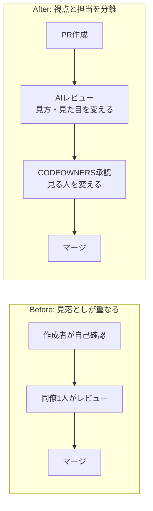
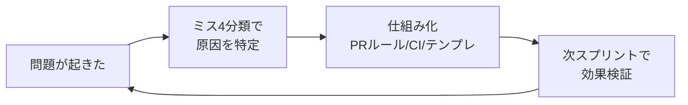

# 「以後気をつけます」をレトロで終わらせない —— 失敗学 × スクラム × AIレビューでミスを仕組み化する

## TL;DR

- ミスは「注意」ではなく「仕組み」で減らす。速いチームは注意深い人ではなく、確認と学習のループを設計している
- **AIレビュー ＋ CODEOWNERS** = ダブルチェック三原則（見る人・見方・見た目を変える）
- ミスは「気をつけます」の前に **4分類（注意不足／伝達不良／計画不良／学習不足）** で原因を特定する
- レトロの改善は個人の努力に戻さず、**PRルール・CI・テンプレへ昇格**させる

## はじめに

ミスが起きたとき、振り返りが「以後気をつけます」で終わってしまった経験はないでしょうか。

「注意する」「気をつける」は、一見まっとうな対策に見えて、実は**個人の注意力に依存した対策**です。人は必ず疲れるし、忘れるし、見落とします。だからこそ、速くて安定したチームは「注意深い人」に頼るのではなく、**二重の確認と学習のループを仕組みとして設計**しています。

本記事では、失敗学の考え方（飯野謙次氏の著書で語られる「ダブルチェック三原則」「ミスの4分類」など）を、私自身がスクラムチームで実践している **AIレビュー・CODEOWNERS・レトロスペクティブ** に結びつけて整理します。

> 筆者はスクラムマスターであり、社内のAI活用推進チームの一員でもあります。個人の反省を「チームのプロセス改善」へ昇格させる、という視点で書いています。

### 対象読者

- チームのミス・手戻りを減らしたいエンジニア / テックリード / EM
- スクラムマスター、アジャイルコーチ
- コードレビューやCIに「AI活用」を組み込みたい方
- 「振り返りが形骸化している」と感じている方

### この記事でわかること

- 「注意する」ではなく「仕組みで防ぐ」への発想転換
- **ダブルチェック三原則**を AIレビュー × CODEOWNERS にどう対応させるか
- **ミスの4分類**を使ったレトロスペクティブの進め方
- 振り返りで出た改善を「その場限り」で終わらせず、PRルールやCIに昇格させる方法

### 前提

- GitHub で Pull Request（以下 PR）ベースの開発をしている
- スクラム（またはそれに近い反復型開発）を回している
- AIコードレビューツール（GitHub Copilot のレビュー機能、CodeRabbit、自作Bot など）が利用できる

> **用語補足**
>
> - **CODEOWNERS**: GitHub で「このディレクトリ/ファイルの変更は、指定したユーザー/チームのレビュー承認を必須にする」設定ファイル。
> - **レトロスペクティブ（レトロ）**: スクラムで、スプリント（開発の反復単位）の最後に行う振り返りの会。
> - **失敗学**: 失敗を隠さず分析し、再発防止の知識として活用する学問領域。

## 結論

ミスは「気合い」ではなく「設計」で減らします。本記事の主張は次の3つです。

1. **確認は"条件を変えて"二重にする** —— AIレビュー（見方・見た目を変える）＋ CODEOWNERS（見る人を変える）
2. **ミスは分類してから対策する** —— 「注意不足／伝達不良／計画不良／学習不足」のどれかを特定する
3. **改善はその場で終わらせず仕組みに昇格させる** —— レトロのアクションを PRルール・CI・テンプレに落とし込む

---

## 1. ダブルチェック三原則 —— なぜ「もう一度見て」では防げないのか

### 「同じやり方で2回」は意味が薄い

「ダブルチェックしておいて」と言われて、同じ資料を同じ順番でもう一度読む——これはあまり効果がありません。

**1人目が見落としやすい箇所は、2人目も同じ手順では同じように見落とす**からです。ダブルチェックの本質は「同じ確認を2度やる」ことではなく、**確認の"条件"を変える**ことにあります。

### 三原則

| 原則 | 意味 | 具体例 |
|------|------|--------|
| **見る人を変える** | 別の人が確認する | 上司や別担当に最終確認を依頼する |
| **見方を変える** | 手順・順序を変える | チェックリストを下から読む／入力者と読み上げ役を入れ替える |
| **見た目を変える** | 表現形式を変える | 数字の表を折れ線グラフにして異常値を目で見つける |

例えば Excel への転記作業では、次のように役割を入れ替えます。

```text
【入力時】
  A が原稿を読み上げる → B が入力する

【ダブルチェック時】
  B が入力済みデータを読み上げる → A が原稿と照合する
  ※ 同じ原稿を見続けるのではなく、「読む側」と「打つ側」を入れ替える（＝見方を変える）
```

### PRレビューへの当てはめ

この三原則は、そのまま **PRの二段構え（AIレビュー ＋ CODEOWNERS）** に対応します。

| 三原則 | PRでの実践 |
|--------|-----------|
| **見る人を変える** | **CODEOWNERS** で、その領域の担当者のレビュー承認を必須にする |
| **見方を変える** | **AIレビュー**が、差分全体・パターン・セキュリティなど人間と違う切り口で見る |
| **見た目を変える** | AIが指摘をカテゴリ分けやサマリで提示し、人間レビューとは別フォーマットで見せる |

Before / After で見ると、確認の「視点」と「担当」が分離されているのがポイントです。



Before は「同じ diff を、同じような順番で読む」ため見落としが重なります。After は AIと人間で**見方・見た目・見る人**がすべて変わるため、見落としの重なりが減ります。

### 運用のポイント

- **PRは必ずAIレビューを通す**ようにする（例: main向けPRでは必須チェックに設定）
- **CODEOWNERS の承認を必須**にして、「必ずこの領域の人が見る」を保証する
- AIが拾えて人間が見落としがちな例（例: 例外処理の抜け、境界値、秘匿情報のハードコード）を1つチームで共有すると、導入の納得感が高まります

> **注意**: AIレビューは「最低限の品質基準」を機械的に押さえる役割です。設計意図やドメイン妥当性の判断は人間（CODEOWNERS）に残す、という役割分担を明文化しておくと形骸化しません。

---

## 2. ミスの4分類 —— 「気をつけます」を禁止する

### なぜ分類するのか

ミスが起きたとき「気をつけます」で終わると、**原因が特定されないまま**なので同じミスが再発します。失敗学では、仕事上のミスをまず次の4つに分類し、**分類ごとに対策の方向を変える**ことを勧めます。

| 分類 | 中身 | 対策の方向性 |
|------|------|-------------|
| ① **注意不足** | うっかり、確認漏れ | 確認のタイミングを決める／ダブルチェックの質を上げる |
| ② **伝達不良** | 情報の受け渡しミス、共有不足 | 暗黙知を形式知にする／記録・共有の仕組み |
| ③ **計画不良** | 見積もり・準備不足 | 「甘かった」で終わらせず、何がどう甘かったかを具体化 |
| ④ **学習不足** | 過去と同型のミスの再発 | 過去の失敗を仕組み（ルール・自動化）に昇格させる |

ポイントは、**同じ「テスト漏れ」でも分類が違えば対策が違う**ことです。

- 単なる確認漏れ → ①注意不足 → チェックリスト / CI
- 仕様の認識ズレでテスト観点が抜けた → ②伝達不良 → 仕様の書き方・受け入れ条件の見直し
- そもそもテスト時間を見積もっていなかった → ③計画不良 → 見積もりプロセスの改善

### レトロスペクティブへの当てはめ

スクラムの**レトロは、この4分類を使う絶好の場**です。「うまくいかなかったこと」を出しっぱなしにせず、分類してから改善アクションに落とします。

```markdown
## 振り返り（ミスの4分類）
- 注意不足 : 設定ミス、テスト漏れ など
- 伝達不良 : 仕様の認識ズレ、引き継ぎ不足 など
- 計画不良 : 見積もりの甘さ、依存関係の見落とし など
- 学習不足 : 過去と同型の再発 など

## 改善アクション（"仕組み化するもの"だけ残す）
- [ ] PRテンプレにチェック項目を追加
- [ ] CI に lint / テストを追加
- [ ] CODEOWNERS を更新
- [ ] Runbook / ドキュメントに追記
```

> **スクラムマスターの視点**
> レトロの役割は「犯人探し」ではなく、**個人の反省をチームのプロセス改善に変換すること**です。「誰が」ではなく「どの分類のミスが、どの仕組みの穴から起きたか」に会話を向けると、心理的安全性を保ったまま原因分析ができます。

---

## 3. 「赤福」的な仕組み化 —— 改善を個人の努力に戻さない

### 改善は"人"ではなく"仕組み"に残す

失敗学では、良い改善とは「担当者ががんばって注意する」ではなく、**間違えようがない状態を作業手順そのものに埋め込むこと**だとされます（書籍では老舗和菓子店「赤福」の製造・品質管理の事例として紹介されています）。

ここで大事なのは、**改善を"人の努力"に戻してはいけない**という原則です。人の努力に依存した対策は、担当が変わったり忙しくなったりした瞬間に崩れます。

### 「アクション」を「仕組み」に昇格させる

レトロで出た改善を、次のように**チームの資産（仕組み）へ昇格**させます。

| レトロで出た声 | 個人依存の対策（NG） | 仕組み化（OK） |
|----------------|---------------------|----------------|
| 「またフォーマット崩れの指摘が出た」 | 「気をつけてPRする」 | CI に formatter / lint を追加して自動化 |
| 「特定領域のレビュー観点が抜けた」 | 「詳しい人が見るようにする」 | CODEOWNERS に領域担当を登録して承認必須化 |
| 「同じ考慮漏れが再発した」 | 「次から意識する」 | PRテンプレのチェックリストに1行追加 |



こうして「注意する」という対策を、**AIレビュー・CI・CODEOWNERS・テンプレという"間違えにくい仕組み"に置き換えていく**のが赤福の教えです。

---

## 4. メールの章 —— 「頭の中・口頭」を外部化する

### 伝達不良の多くは"外部化されていない"ことが原因

失敗学の書籍には、メール（＝記録に残る伝達手段）の使い方を扱う章があります。要点は、**重要な情報を「口頭」や「頭の中」に置かず、後から参照できる形に外部化する**ことです。口頭の指示や記憶は、伝達不良（ミス分類②）の温床になります。

### 開発における外部化の実例

開発の現場では、次のものがすべて「外部化」の手段です。

| 外部化の手段 | 何を外部化するか |
|--------------|------------------|
| **PR description** | 変更の意図・背景・確認した観点・残課題 |
| **Issue** | やること・受け入れ条件・議論の経緯 |
| **レトロ議事録** | 起きた問題・原因分類・改善アクション |
| **Runbook / ドキュメント** | 手順・判断基準・過去のトラブル対応 |

```markdown
## PR description テンプレ例
### 目的 / 背景
- なぜこの変更が必要か（Issue: #123）
### 変更内容
- 何をどう変えたか
### 確認した観点（＝レビュアーに伝える"見方"）
- [ ] 境界値・異常系のテスト
- [ ] 秘匿情報のハードコードがないこと
### 残課題 / 補足
- 別PRで対応する点、既知の制約
```

「確認した観点」を書いておくと、レビュアーは**別の見方**でチェックしやすくなり、1章のダブルチェック三原則ともつながります。口頭で済ませていたことをPRやIssueに書くだけで、伝達不良は大きく減ります。

---

## まとめ

失敗学の考え方と、スクラム × AIレビューの実践は、きれいに対応します。

| 失敗学の概念 | チームでの実践 |
|--------------|----------------|
| ダブルチェック三原則 | AIレビュー（見方・見た目）＋ CODEOWNERS（見る人） |
| ミスの4分類 | レトロで「注意不足／伝達不良／計画不良／学習不足」に分類 |
| 赤福（仕組み化） | 改善を PRルール・CI・テンプレへ昇格 |
| メールの章（外部化） | PR description・Issue・レトロ議事録に残す |

### 重要なポイント

1. 確認は「同じことを2回」ではなく、**人・見方・見た目を変えて**二重にする
2. ミスは「気をつけます」の前に、**4分類のどれか**を特定する
3. 改善は**個人の努力に戻さず**、間違えにくい仕組みへ昇格させる
4. 口頭・記憶に頼らず、**PR / Issue / 議事録に外部化**する

### 今日からできるアクション

- [ ] main向けPRで **AIレビューを必須**にする
- [ ] 重要な領域を **CODEOWNERS に登録**して承認必須にする
- [ ] 次のレトロで **ミス4分類のフレーム**を使ってみる
- [ ] レトロのアクションを1つ、**CI か PRテンプレに昇格**させる

「注意深い人」を増やすのではなく、「注意しなくても間違えにくいチーム」を設計していきましょう。

## 参考リンク

- 飯野謙次『仕事が速いのにミスしない人は、何をしているのか？』（失敗学の考え方の出典）
  - ※ 本記事の「ダブルチェック三原則」「ミスの4分類」「赤福」「メールの章」は同氏の失敗学関連書籍で紹介されている考え方を筆者が再構成したものです。正確な記述は書籍をご参照ください。
- [About code owners - GitHub Docs](https://docs.github.com/en/repositories/managing-your-repositories-settings-and-features/customizing-your-repository/about-code-owners)
- [スクラムガイド（日本語）](https://scrumguides.org/docs/scrumguide/v2020/2020-Scrum-Guide-Japanese.pdf)
- [心理的安全性と生産性を両立する自動ソースレビュー導入（CodeRabbit活用）](./auto-source-review.md)
