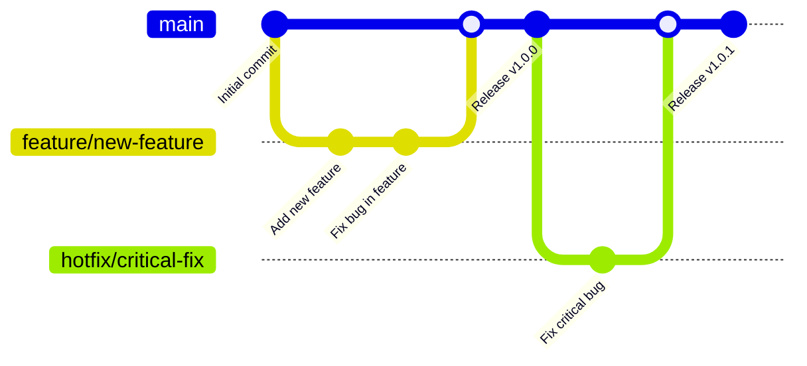

# バージョン管理

## Repository

- [GitHub](https://github.com/zucky2021/it-vault)

## Branch workflow



## GitHub Flow の説明

### 基本的な流れ

1. **main ブランチ**: 常にデプロイ可能な状態を保つ
2. **feature ブランチ**: 新機能開発用
3. **hotfix ブランチ**: 緊急修正用

### ワークフローの手順

1. **feature ブランチの作成**
   ```bash
   git checkout -b feature/new-feature
   ```

2. **開発とコミット**
   ```bash
   git add .
   git commit -m "Add new feature"
   ```

3. **プルリクエストの作成**
   - GitHub上でプルリクエストを作成
   - コードレビューを依頼

4. **マージとデプロイ**
   ```bash
   git checkout main
   git merge feature/new-feature
   git push origin main
   ```

5. **緊急修正の場合**
   ```bash
   git checkout -b hotfix/critical-fix
   # 修正をコミット
   git checkout main
   git merge hotfix/critical-fix
   ```

### 注意点

- mainブランチは常にデプロイ可能な状態を保つ
- 小さな単位で頻繁にマージする
- プルリクエストによるコードレビューを必須とする
- 機能ブランチは短期的に使用し、マージ後は削除する
