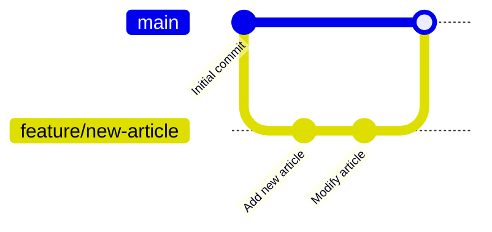

# バージョン管理

## Repository

- [GitHub](https://github.com/zucky2021/it-vault)

## Branch workflow

- 記事を作成する時のみPRを作成する
- 基本的には**GitHub Flow**

### 注意点

- mainブランチは常にデプロイ可能な状態を保つ
- 小さな単位で頻繁にマージする
- プルリクエストによるコードレビューを必須とする
- 機能ブランチは短期的に使用し、マージ後は削除する
